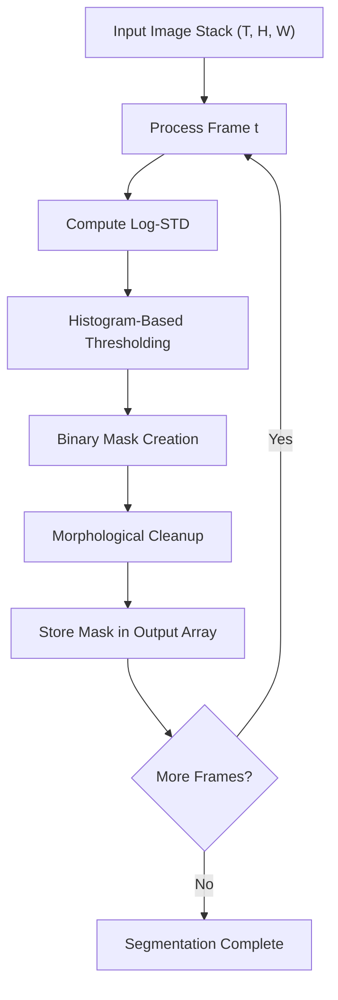
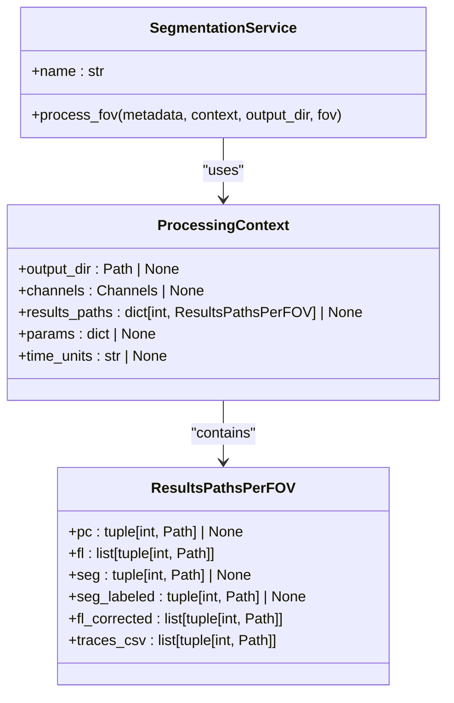
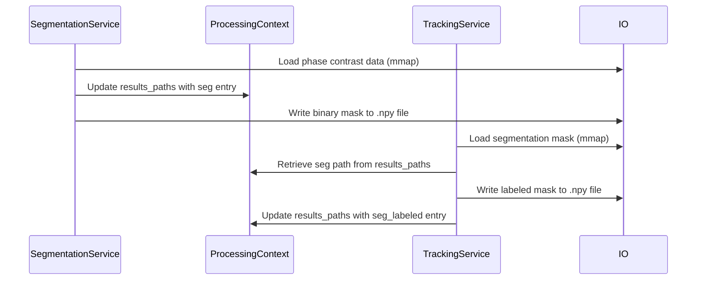

# Segmentation

<cite>
**Referenced Files in This Document**   
- [log_std.py](file://pyama-core/src/pyama_core/processing/segmentation/log_std.py)
- [segmentation.py](file://pyama-core/src/pyama_core/processing/workflow/services/steps/segmentation.py)
- [iou.py](file://pyama-core/src/pyama_core/processing/tracking/iou.py)
- [tracking.py](file://pyama-core/src/pyama_core/processing/workflow/services/steps/tracking.py)
- [types.py](file://pyama-core/src/pyama_core/processing/workflow/services/types.py)
</cite>

## Table of Contents
1. [Introduction](#introduction)
2. [LOG-STD Segmentation Algorithm](#log-std-segmentation-algorithm)
3. [Core Processing Pipeline](#core-processing-pipeline)
4. [Parameter Configuration and Control](#parameter-configuration-and-control)
5. [Segmentation Output and Context Management](#segmentation-output-and-context-management)
6. [Integration with Downstream Tracking](#integration-with-downstream-tracking)
7. [Performance Considerations](#performance-considerations)
8. [Troubleshooting and Parameter Tuning](#troubleshooting-and-parameter-tuning)
9. [Conclusion](#conclusion)

## Introduction
The LOG-STD (Laplacian of Gaussian with Standard Deviation) segmentation method is a key component in the cell detection pipeline for phase contrast microscopy images. This technique enables robust identification of cellular structures by leveraging local intensity variation statistics. The implementation is optimized for both computational efficiency and memory usage, making it suitable for large field-of-view (FOV) time-lapse microscopy data. This document details the algorithmic foundation, parameter configuration, integration with downstream processes, and practical considerations for effective use of the LOG-STD segmentation method.

## LOG-STD Segmentation Algorithm
The LOG-STD method implements a multi-scale blob detection approach specifically adapted for phase contrast microscopy images. The algorithm computes per-pixel log standard deviation values using uniform filtering to efficiently capture local intensity variations at multiple scales. This approach is particularly effective for detecting cell boundaries and internal structures in phase contrast images where cells appear as regions of varying optical density against a transparent background.

The core innovation lies in the use of uniform filtering to compute window statistics in O(1) time per pixel, independent of window size. This optimization enables efficient processing of large images without compromising on detection sensitivity. The algorithm processes 3D image stacks frame-by-frame, maintaining low peak memory usage while preserving temporal information for downstream tracking applications.

**Section sources**
- [log_std.py](file://pyama-core/src/pyama_core/processing/segmentation/log_std.py#L0-L131)

## Core Processing Pipeline
The segmentation pipeline executes a sequence of operations for each frame in the input image stack:

1. **Log-STD Computation**: For each 2D frame, the algorithm calculates the log standard deviation using local mean and mean-of-squares computed via uniform filtering. The effective window size is determined by the neighborhood half-size parameter.
2. **Threshold Selection**: A histogram-based thresholding method identifies the background mode and sets the detection threshold at mode + 3σ, where σ represents the standard deviation of background values.
3. **Binary Mask Creation**: Pixels with log-STD values exceeding the threshold are classified as foreground.
4. **Morphological Cleanup**: The binary mask undergoes hole filling, opening, and closing operations to remove noise and ensure topological correctness of detected cells.

The pipeline processes 3D stacks frame-by-frame, writing results directly to a preallocated output array to minimize memory overhead. This in-place processing strategy is critical for handling large microscopy datasets.

**Diagram sources**
- [log_std.py](file://pyama-core/src/pyama_core/processing/segmentation/log_std.py#L93-L130)

**Section sources**
- [log_std.py](file://pyama-core/src/pyama_core/processing/segmentation/log_std.py#L93-L130)

## Parameter Configuration and Control
The LOG-STD segmentation algorithm exposes several parameters that control its behavior:

- **Size parameter**: Controls the neighborhood half-size for the uniform filter, effectively determining the scale of detected blobs. The effective window size is 2*size+1.
- **Morphological operation parameters**: The structuring element size (default 7×7) and iteration count (default 3) for opening and closing operations control the degree of noise removal and boundary smoothing.
- **Histogram bins**: The number of bins (default 200) used in threshold calculation affects the precision of background mode detection.

These parameters are currently hardcoded in the implementation but could be exposed through the ProcessingContext.params dictionary for runtime configuration. The algorithm automatically handles data type conversion, accepting float-like input and producing boolean output masks.

**Section sources**
- [log_std.py](file://pyama-core/src/pyama_core/processing/segmentation/log_std.py#L24-L90)

## Segmentation Output and Context Management
The segmentation results are managed through a structured processing context system that ensures proper data flow between pipeline stages. The SegmentationService class handles the complete workflow for each field of view (FOV), including:

- Loading phase contrast data from memory-mapped files to minimize memory usage
- Validating input data dimensions and types
- Managing output file paths according to a standardized naming convention
- Recording processing results in the ProcessingContext object

The service checks for existing segmentation results to avoid redundant processing and maintains references to input and output files through the ResultsPathsPerFOV data structure. Segmentation masks are stored as boolean NumPy arrays in .npy format, preserving the original spatial and temporal dimensions of the input data.

**Diagram sources**
- [types.py](file://pyama-core/src/pyama_core/processing/workflow/services/types.py#L25-L30)
- [segmentation.py](file://pyama-core/src/pyama_core/processing/workflow/services/steps/segmentation.py#L0-L125)

**Section sources**
- [segmentation.py](file://pyama-core/src/pyama_core/processing/workflow/services/steps/segmentation.py#L0-L125)
- [types.py](file://pyama-core/src/pyama_core/processing/workflow/services/types.py#L0-L62)

## Integration with Downstream Tracking
The segmentation results serve as the foundation for cell tracking operations in the subsequent processing stage. The binary masks produced by the LOG-STD method are consumed by the IoU-based tracking algorithm, which assigns consistent cell IDs across frames. This integration is facilitated through the ProcessingContext object, which maintains references to both raw segmentation masks and their labeled counterparts.

The tracking workflow follows a specific sequence:
1. SegmentationService processes phase contrast data to generate binary masks
2. Results are recorded in the ProcessingContext.results_paths dictionary
3. TrackingService retrieves the segmentation masks and applies connected component labeling
4. Temporal associations are established using Intersection-over-Union (IoU) metrics
5. Labeled segmentation masks are written to disk for further analysis

This pipeline ensures that segmentation and tracking operations are tightly coupled while maintaining separation of concerns between processing stages.

**Diagram sources**
- [segmentation.py](file://pyama-core/src/pyama_core/processing/workflow/services/steps/segmentation.py#L0-L125)
- [tracking.py](file://pyama-core/src/pyama_core/processing/workflow/services/steps/tracking.py#L0-L126)
- [iou.py](file://pyama-core/src/pyama_core/processing/tracking/iou.py#L279-L360)

**Section sources**
- [tracking.py](file://pyama-core/src/pyama_core/processing/workflow/services/steps/tracking.py#L0-L126)
- [iou.py](file://pyama-core/src/pyama_core/processing/tracking/iou.py#L279-L360)

## Performance Considerations
The LOG-STD segmentation implementation incorporates several optimizations to address performance challenges associated with large microscopy datasets:

- **Memory Efficiency**: The use of memory-mapped files (via np.load with mmap_mode="r") allows processing of datasets larger than available RAM by loading data on-demand.
- **Computational Efficiency**: Uniform filtering enables O(1) computation of local statistics regardless of window size, making multi-scale analysis computationally feasible.
- **Frame-by-Frame Processing**: 3D stacks are processed one frame at a time, keeping peak memory usage proportional to a single frame rather than the entire volume.
- **In-Place Operations**: Results are written directly to preallocated output arrays, eliminating temporary storage overhead.

For large FOVs, the primary performance bottleneck is typically the uniform filtering operations, which scale linearly with image area. The algorithm's memory footprint is dominated by the simultaneous storage of input data, log-STD intermediate results, and output masks, requiring approximately 3× the size of a single frame in working memory.

**Section sources**
- [log_std.py](file://pyama-core/src/pyama_core/processing/segmentation/log_std.py#L0-L131)
- [segmentation.py](file://pyama-core/src/pyama_core/processing/workflow/services/steps/segmentation.py#L0-L125)

## Troubleshooting and Parameter Tuning
Segmentation failures can occur due to various factors, particularly with low-contrast images or suboptimal parameter settings. The following guidance can help resolve common issues:

**Low-Contrast Images**: When cells exhibit minimal intensity variation from the background:
- Verify that the phase contrast data is properly normalized
- Check for proper microscope calibration and focus
- Consider preprocessing steps to enhance contrast if available

**Over-segmentation (Too Many Objects)**:
- Increase the morphological structuring element size to remove small artifacts
- Adjust the thresholding strategy by modifying the histogram bin count
- Apply additional size filtering in downstream processing

**Under-segmentation (Missed Cells)**:
- Reduce the neighborhood size parameter to detect smaller structures
- Verify that the input data type is float-like to preserve intensity precision
- Check for proper dynamic range in the input images

**Performance Issues with Large FOVs**:
- Ensure sufficient RAM is available for memory-mapped file operations
- Monitor disk I/O performance, as slow storage can bottleneck processing
- Consider processing multiple FOVs in parallel if system resources permit

The current implementation does not expose all parameters through the configuration system, but future enhancements could allow runtime adjustment of key parameters via the ProcessingContext.params dictionary.

**Section sources**
- [log_std.py](file://pyama-core/src/pyama_core/processing/segmentation/log_std.py#L0-L131)
- [segmentation.py](file://pyama-core/src/pyama_core/processing/workflow/services/steps/segmentation.py#L0-L125)

## Conclusion
The LOG-STD segmentation method provides a robust and efficient solution for cell detection in phase contrast microscopy images. By leveraging statistical texture analysis through log standard deviation computation, the algorithm effectively identifies cellular structures while maintaining computational efficiency. The tight integration with the processing context system ensures seamless data flow to downstream tracking operations, forming a critical link in the overall cell analysis pipeline. Future enhancements could include exposure of additional parameters through the configuration system and adaptive scale selection based on image content characteristics.