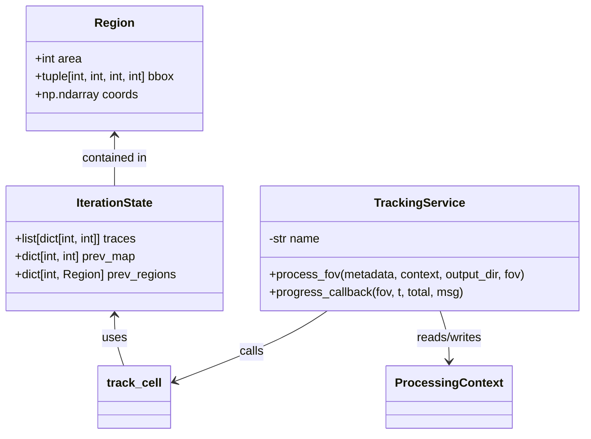
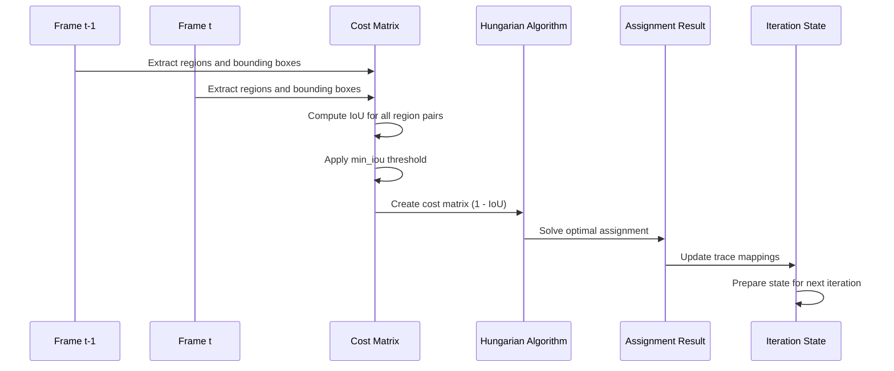
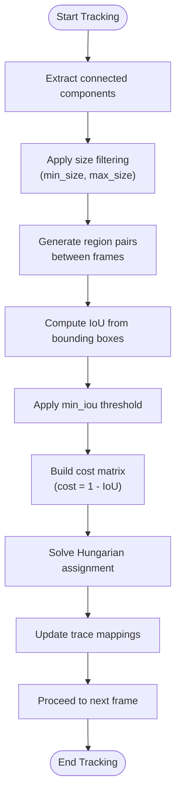

# Tracking

<cite>
**Referenced Files in This Document**   
- [iou.py](file://pyama-core/src/pyama_core/processing/tracking/iou.py)
- [tracking.py](file://pyama-core/src/pyama_core/processing/workflow/services/steps/tracking.py)
</cite>

## Table of Contents
1. [Introduction](#introduction)
2. [Core Components](#core-components)
3. [Tracking Algorithm Overview](#tracking-algorithm-overview)
4. [Parameter Configuration](#parameter-configuration)
5. [Data Flow and Processing Context](#data-flow-and-processing-context)
6. [Performance Characteristics](#performance-characteristics)
7. [Troubleshooting and Optimization](#troubleshooting-and-optimization)

## Introduction

The cell tracking sub-feature enables reconstruction of cell lineages across time-lapse microscopy frames using Intersection-over-Union (IoU) based object matching. This system associates segmented cells between consecutive frames by evaluating spatial overlap and maintaining consistent cell identities throughout the time series. The tracking results are essential for downstream analysis such as lineage tree construction, proliferation analysis, and dynamic behavior characterization.

**Section sources**
- [iou.py](file://pyama-core/src/pyama_core/processing/tracking/iou.py#L1-L30)
- [tracking.py](file://pyama-core/src/pyama_core/processing/workflow/services/steps/tracking.py#L1-L10)

## Core Components

The tracking functionality is implemented through two primary components: the core IoU-based tracking algorithm and the processing service that integrates it into the workflow. The `track_cell` function performs the actual cell association using Hungarian assignment on IoU scores, while the `TrackingService` class manages data loading, output handling, and integration with the processing context.

The algorithm operates on pre-segmented binary masks and produces labeled output arrays where each unique integer ID represents a tracked cell lineage. Tracking state is maintained through frame-to-frame iterations using region properties and trace mappings.



**Diagram sources**
- [iou.py](file://pyama-core/src/pyama_core/processing/tracking/iou.py#L19-L51)
- [tracking.py](file://pyama-core/src/pyama_core/processing/workflow/services/steps/tracking.py#L25-L125)

**Section sources**
- [iou.py](file://pyama-core/src/pyama_core/processing/tracking/iou.py#L1-L361)
- [tracking.py](file://pyama-core/src/pyama_core/processing/workflow/services/steps/tracking.py#L1-L127)

## Tracking Algorithm Overview

The tracking algorithm implements a frame-to-frame association approach using IoU-based cost minimization. For each consecutive frame pair, the system extracts connected components and computes pairwise IoU values between regions in adjacent frames. A cost matrix is constructed where costs are defined as 1 - IoU, and the Hungarian algorithm solves for optimal one-to-one assignment that minimizes total cost.

The algorithm maintains cell identities by building trace mappings that record which segmentation label corresponds to each tracked cell at each time point. These traces are initialized from the first frame's regions and propagated forward through the time series. The process handles cell movement, shape changes, and moderate variations in size, but does not support cell division or merging events.



**Diagram sources**
- [iou.py](file://pyama-core/src/pyama_core/processing/tracking/iou.py#L109-L147)
- [iou.py](file://pyama-core/src/pyama_core/processing/tracking/iou.py#L227-L276)

**Section sources**
- [iou.py](file://pyama-core/src/pyama_core/processing/tracking/iou.py#L100-L361)

## Parameter Configuration

The tracking behavior is controlled by several key parameters that balance sensitivity to cell movement, tolerance for shape changes, and robustness to segmentation artifacts:

- **min_iou**: Minimum Intersection-over-Union threshold (default: 0.1) for considering a region pair as a valid candidate match. Lower values allow more lenient matching but increase false associations.
- **min_size**: Optional minimum region size in pixels (inclusive) for tracking. Smaller regions are filtered out before matching.
- **max_size**: Optional maximum region size in pixels (inclusive) for tracking. Larger regions are filtered out before matching.

These parameters are passed to the `track_cell` function and influence both the candidate selection phase and the final assignment quality. The min_iou parameter directly affects the sparsity of the cost matrix by eliminating pairs that fall below the threshold, while size filters help eliminate noise and artifacts from consideration.



**Diagram sources**
- [iou.py](file://pyama-core/src/pyama_core/processing/tracking/iou.py#L149-L189)
- [iou.py](file://pyama-core/src/pyama_core/processing/tracking/iou.py#L279-L360)

**Section sources**
- [iou.py](file://pyama-core/src/pyama_core/processing/tracking/iou.py#L279-L360)

## Data Flow and Processing Context

The tracking results are integrated into the processing pipeline through the `ProcessingContext` object, which maintains references to input and output file paths across processing stages. The `TrackingService` loads segmented data from the previous step and writes labeled output arrays to memory-mapped files, enabling efficient handling of large datasets.

Tracked segmentation results are stored in `.npy` format with filenames following the pattern `{base_name}_fov_{fov:03d}_seg_labeled_ch_{ch}.npy`. These outputs contain integer labels where each unique value represents a distinct cell lineage across time points. The processing context is updated with the output path, making it available to downstream analysis steps such as feature extraction and visualization.

```mermaid
graph TB
subgraph "Input"
SegmentedData[(Segmented Masks<br/>(T, H, W) bool)]
end
subgraph "Processing"
TrackingService[TrackingService]
CostMatrix[IoU Cost Matrix]
Assignment[Optimal Assignment]
end
subgraph "Output"
LabeledData[(Labeled Segmentation<br/>(T, H, W) uint16)]
Context[ProcessingContext]
end
SegmentedData --> TrackingService
TrackingService --> CostMatrix
CostMatrix --> Assignment
Assignment --> LabeledData
LabeledData --> Context
Context --> Downstream["Downstream Analysis<br/>(Feature Extraction, etc.)"]
style SegmentedData fill:#f9f,stroke:#333
style LabeledData fill:#bbf,stroke:#333
style Context fill:#ff9,stroke:#333
```

**Diagram sources**
- [tracking.py](file://pyama-core/src/pyama_core/processing/workflow/services/steps/tracking.py#L25-L125)
- [iou.py](file://pyama-core/src/pyama_core/processing/tracking/iou.py#L279-L360)

**Section sources**
- [tracking.py](file://pyama-core/src/pyama_core/processing/workflow/services/steps/tracking.py#L25-L125)

## Performance Characteristics

The tracking algorithm exhibits quadratic complexity O(n×m) in the number of regions between consecutive frames, where n and m are the number of segmented objects in adjacent frames. This complexity arises from the pairwise IoU computation required to build the cost matrix for the Hungarian algorithm. Memory usage scales linearly with the number of tracked cells and time points, as the system maintains trace mappings for all active lineages.

To mitigate performance bottlenecks, the implementation uses several optimization strategies:
- Bounding box overlap is checked before full IoU computation to quickly eliminate non-overlapping regions
- Memory-mapped arrays are used for input/output to handle large datasets efficiently
- Size filtering reduces the number of regions considered in the matching process
- The algorithm processes frames sequentially, maintaining only the previous frame's state in memory

For large datasets, processing time is dominated by the IoU computation and assignment solving steps, with progress callbacks provided to monitor execution.

**Section sources**
- [iou.py](file://pyama-core/src/pyama_core/processing/tracking/iou.py#L109-L147)
- [iou.py](file://pyama-core/src/pyama_core/processing/tracking/iou.py#L227-L276)

## Troubleshooting and Optimization

Common tracking issues and their solutions include:

**Fragmentation issues** (single cells appearing as multiple tracks):
- Increase `min_iou` threshold to require stronger spatial overlap
- Apply stricter size filtering to eliminate small fragments
- Ensure segmentation quality is sufficient before tracking

**Merging issues** (multiple cells tracked as one):
- Decrease `min_iou` threshold to allow more lenient matching
- Verify that segmentation properly separates touching cells
- Consider preprocessing steps like watershed separation

**Drift issues** (tracks jumping between cells):
- Increase `min_iou` threshold to prevent erroneous matches
- Implement additional constraints such as maximum displacement limits
- Validate that cell movement is physically plausible

**Newborn cell detection**:
The current algorithm only seeds traces from the first frame, meaning cells appearing later in the time series will not be assigned new IDs unless they overlap with existing tracks. For datasets with significant cell proliferation, consider processing in overlapping windows or implementing gap-closing extensions.

Optimization recommendations:
- Start with default parameters and adjust `min_iou` based on observed tracking quality
- Use size filters to eliminate noise and focus on biologically relevant objects
- Monitor memory usage for large datasets and consider processing smaller regions of interest
- Validate tracking results visually using the visualization components

**Section sources**
- [iou.py](file://pyama-core/src/pyama_core/processing/tracking/iou.py#L279-L360)
- [tracking.py](file://pyama-core/src/pyama_core/processing/workflow/services/steps/tracking.py#L25-L125)