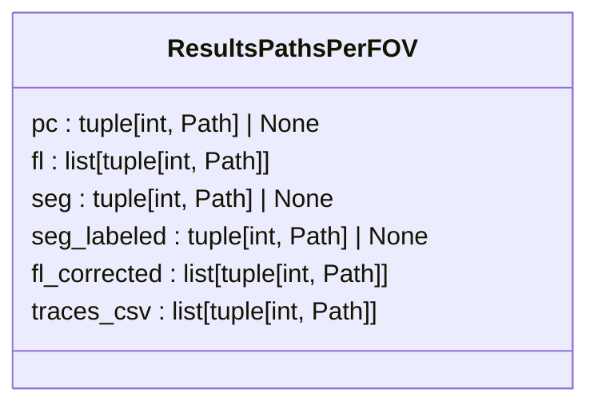
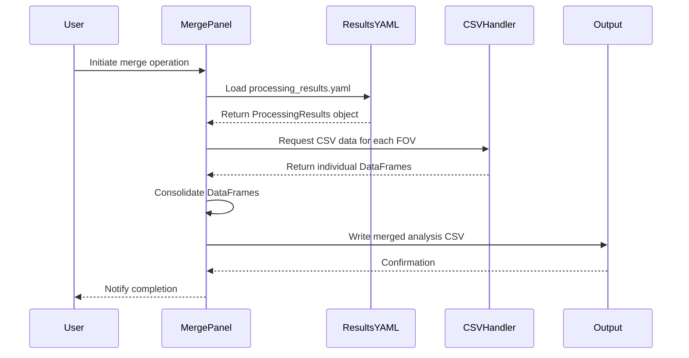
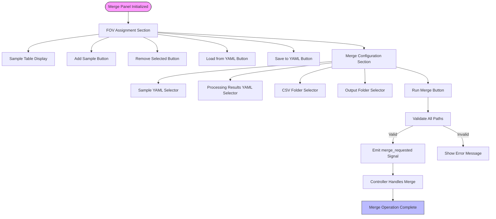

# Results Merging

<cite>
**Referenced Files in This Document**   
- [results_yaml.py](file://pyama-core/src/pyama_core/io/results_yaml.py)
- [analysis_csv.py](file://pyama-core/src/pyama_core/io/analysis_csv.py)
- [processing_csv.py](file://pyama-core/src/pyama_core/io/processing_csv.py)
- [types.py](file://pyama-core/src/pyama_core/processing/workflow/services/types.py)
- [merge_panel.py](file://pyama-qt/src/pyama_qt/processing/panels/merge_panel.py)
</cite>

## Table of Contents
1. [Introduction](#introduction)
2. [ResultsPathsPerFOV Data Structure](#resultspathsperfov-data-structure)
3. [Merging Logic for Different Data Types](#merging-logic-for-different-data-types)
4. [Merged Output Structures](#merged-output-structures)
5. [Common Issues and Error Handling](#common-issues-and-error-handling)
6. [Performance Optimization for Large-Scale Merges](#performance-optimization-for-large-scale-merges)
7. [User Interface for Merge Operations](#user-interface-for-merge-operations)

## Introduction
The Results Merging sub-feature in PyAMA is responsible for aggregating processed outputs from multiple fields of view (FOVs) into consolidated datasets. This functionality enables downstream analysis and visualization modules to work with unified data representations rather than fragmented per-FOV results. The system handles various data formats including YAML, CSV, and NPY files, ensuring consistent merging logic across different data types. The merging process is orchestrated through the ProcessingResults class and leverages the ResultsPathsPerFOV data structure to track individual output files across FOVs.

**Section sources**
- [results_yaml.py](file://pyama-core/src/pyama_core/io/results_yaml.py#L14-L60)
- [types.py](file://pyama-core/src/pyama_core/processing/workflow/services/types.py#L15-L21)

## ResultsPathsPerFOV Data Structure
The ResultsPathsPerFOV class serves as the primary mechanism for tracking individual output files across multiple FOVs. This dataclass maintains references to various processed results organized by FOV index, enabling systematic collection and merging operations. Each instance contains file paths for different processing outputs including phase contrast (pc), fluorescence (fl), segmentation (seg), labeled segmentation (seg_labeled), corrected fluorescence (fl_corrected), and trace CSV files (traces_csv).

The structure uses tuples containing both the channel index and file path, allowing for proper channel-specific data association during the merge process. For single-file outputs like phase contrast or segmentation, optional tuple fields are used, while list fields accommodate multi-channel data such as fluorescence images. This design ensures that all per-FOV outputs are properly tracked and can be efficiently accessed during the merging phase.



**Diagram sources**
- [types.py](file://pyama-core/src/pyama_core/processing/workflow/services/types.py#L15-L21)

**Section sources**
- [types.py](file://pyama-core/src/pyama_core/processing/workflow/services/types.py#L15-L21)

## Merging Logic for Different Data Types
The merging logic varies depending on the data type and format, with specialized handling for YAML, CSV, and NPY files. For YAML files, the system uses the ProcessingResults class which implements the Mapping interface to provide dictionary-like access to merged results. The discover_processing_results function first attempts to load from a processing_results.yaml file, falling back to directory-based discovery if the YAML file is unavailable.

CSV merging follows a structured approach where processing CSV files contain FOV, cell, frame, time, quality, position, and feature columns. The system uses pandas DataFrames for efficient manipulation, with dedicated functions like write_dataframe and get_dataframe handling I/O operations. Analysis CSV files use time as the index with cell IDs as columns, and include optional time unit metadata in comment headers.

NPY file merging is handled through the YAML-based tracking system, where file paths are recorded in the processing_results.yaml structure. The system reconstructs correct paths when data folders are moved by preserving relative path information, ensuring robustness across different deployment scenarios.



**Diagram sources**
- [results_yaml.py](file://pyama-core/src/pyama_core/io/results_yaml.py#L63-L73)
- [processing_csv.py](file://pyama-core/src/pyama_core/io/processing_csv.py#L19-L40)
- [analysis_csv.py](file://pyama-core/src/pyama_core/io/analysis_csv.py#L13-L36)

**Section sources**
- [results_yaml.py](file://pyama-core/src/pyama_core/io/results_yaml.py#L63-L73)
- [processing_csv.py](file://pyama-core/src/pyama_core/io/processing_csv.py#L19-L40)
- [analysis_csv.py](file://pyama-core/src/pyama_core/io/analysis_csv.py#L13-L36)

## Merged Output Structures
The merged output structures are designed to support downstream analysis and visualization modules. The primary output format is the analysis CSV, which organizes data with time as the index and cell IDs as columns. This structure enables straightforward time-series analysis of cellular behavior across multiple FOVs.

The ProcessingResults class provides a unified interface to access merged data, exposing attributes such as project_path, n_fov (number of fields of view), fov_data (dictionary of per-FOV data), channels (channel configuration), and time_units. The class implements Python's Mapping interface, allowing dictionary-style access to results while maintaining type safety through explicit field definitions.

For trace data, the merged output combines individual trace CSV files into a single analysis CSV with proper time alignment. The system preserves metadata such as time units, converting between different time scales (seconds, minutes, hours) as needed to ensure consistency across merged datasets.

```mermaid
erDiagram
PROCESSING_RESULTS {
Path project_path
int n_fov
dict[int, dict[str, Path]] fov_data
dict[str, list[int]] channels
str time_units
}
ANALYSIS_CSV {
float time PK
float cell_0
float cell_1
float cell_2
float cell_N
}
PROCESSING_CSV {
int fov
int cell
int frame
float time
bool good
float position_x
float position_y
float feature_1
float feature_2
}
PROCESSING_RESULTS ||--o{ ANALYSIS_CSV : "generates"
PROCESSING_RESULTS ||--o{ PROCESSING_CSV : "contains"
```

**Diagram sources**
- [results_yaml.py](file://pyama-core/src/pyama_core/io/results_yaml.py#L14-L60)
- [analysis_csv.py](file://pyama-core/src/pyama_core/io/analysis_csv.py#L13-L36)
- [processing_csv.py](file://pyama-core/src/pyama_core/io/processing_csv.py#L19-L40)

**Section sources**
- [results_yaml.py](file://pyama-core/src/pyama_core/io/results_yaml.py#L14-L60)
- [analysis_csv.py](file://pyama-core/src/pyama_core/io/analysis_csv.py#L13-L36)

## Common Issues and Error Handling
Several common issues arise during merge operations, particularly when dealing with missing FOVs, inconsistent data shapes, and file locking. The system implements robust error handling to address these challenges. When FOV directories are missing, the _discover_from_directories function skips invalid entries and continues processing available data, preventing complete merge failure due to partial data loss.

Inconsistent data shapes are handled through pandas' flexible DataFrame operations, which can accommodate varying numbers of cells or time points across FOVs. Missing values are represented as NaN, preserving the integrity of the time series while clearly indicating data gaps. The system validates file integrity before merging, raising descriptive errors for empty or corrupted CSV files.

File locking issues are mitigated through careful resource management and the use of context managers for file operations. The path correction mechanism in _correct_file_path helps resolve issues when data folders are moved, reconstructing valid paths from relative components. For YAML loading, the system provides fallback mechanisms that can reconstruct results from directory structures when the primary YAML file is unavailable or corrupted.

**Section sources**
- [results_yaml.py](file://pyama-core/src/pyama_core/io/results_yaml.py#L200-L250)
- [processing_csv.py](file://pyama-core/src/pyama_core/io/processing_csv.py#L19-L40)

## Performance Optimization for Large-Scale Merges
Efficient handling of large-scale merges is achieved through several optimization strategies. The system leverages pandas DataFrames for in-memory operations, which are highly optimized for numerical computations and data manipulation. For very large datasets, the merge process can be parallelized by processing independent FOVs concurrently before combining the results.

Memory usage is optimized by processing one FOV at a time when generating the final analysis CSV, rather than loading all data into memory simultaneously. The CSV writing process includes efficient formatting options like float_format="%.6f" to control precision and file size. Directory traversal is minimized by caching results when possible, and file existence checks are performed before attempting to load data.

The YAML-based tracking system reduces the need for expensive file system searches by maintaining a centralized record of all output files. This index enables direct access to required files without scanning directories, significantly improving performance for projects with many FOVs.

**Section sources**
- [results_yaml.py](file://pyama-core/src/pyama_core/io/results_yaml.py#L255-L266)
- [analysis_csv.py](file://pyama-core/src/pyama_core/io/analysis_csv.py#L13-L36)
- [processing_csv.py](file://pyama-core/src/pyama_core/io/processing_csv.py#L97-L116)

## User Interface for Merge Operations
The user interface for merge operations is implemented in the ProcessingMergePanel class, providing a comprehensive set of controls for configuring and executing merge tasks. The interface is divided into two main sections: FOV assignment and merge configuration.

The FOV assignment section includes a sample table for managing FOV-to-sample mappings, with controls for adding, removing, and editing entries. Users can load and save sample configurations from YAML files, enabling reproducible merge operations. The merge configuration section provides file selectors for specifying the sample YAML, processing results YAML, CSV data directory, and output folder.

All file selectors include browse buttons that open standard file dialogs, simplifying path specification. The interface validates that all required paths are specified before enabling the merge operation, preventing common configuration errors. Signals are used to communicate with the controller layer, maintaining separation between UI and business logic.



**Diagram sources**
- [merge_panel.py](file://pyama-qt/src/pyama_qt/processing/panels/merge_panel.py#L1-L247)

**Section sources**
- [merge_panel.py](file://pyama-qt/src/pyama_qt/processing/panels/merge_panel.py#L1-L247)