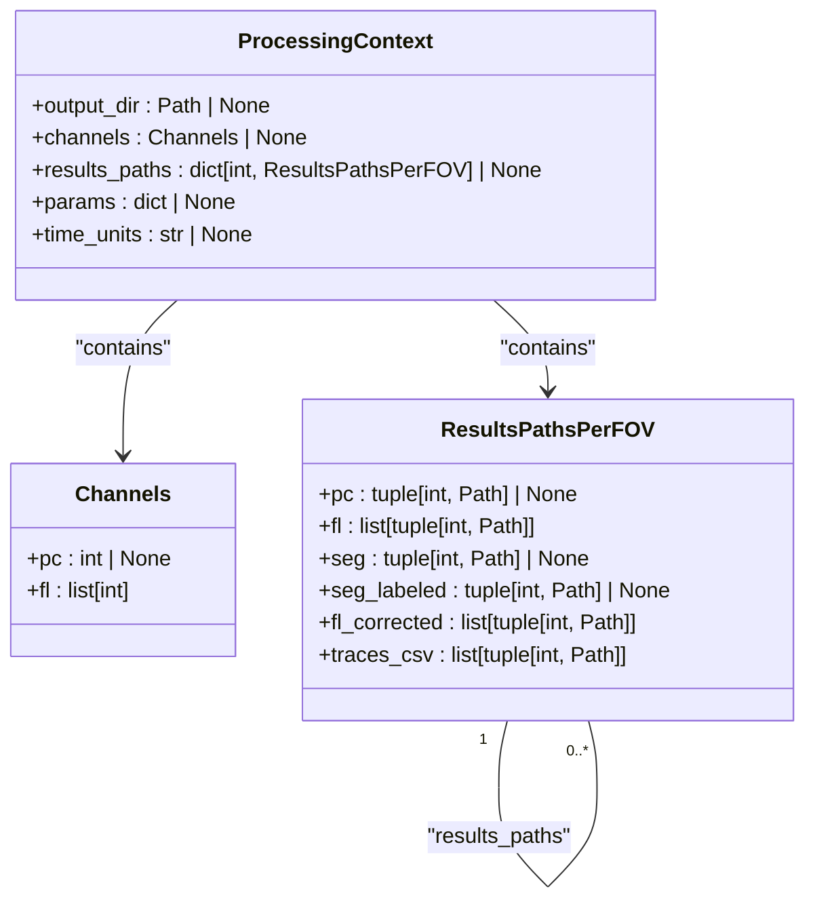
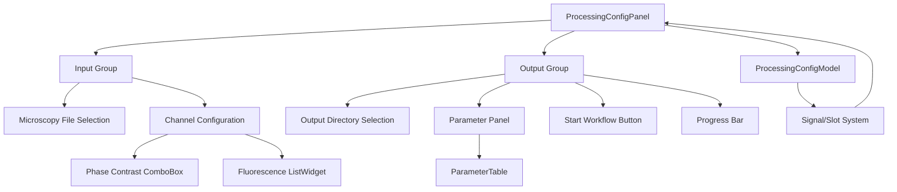
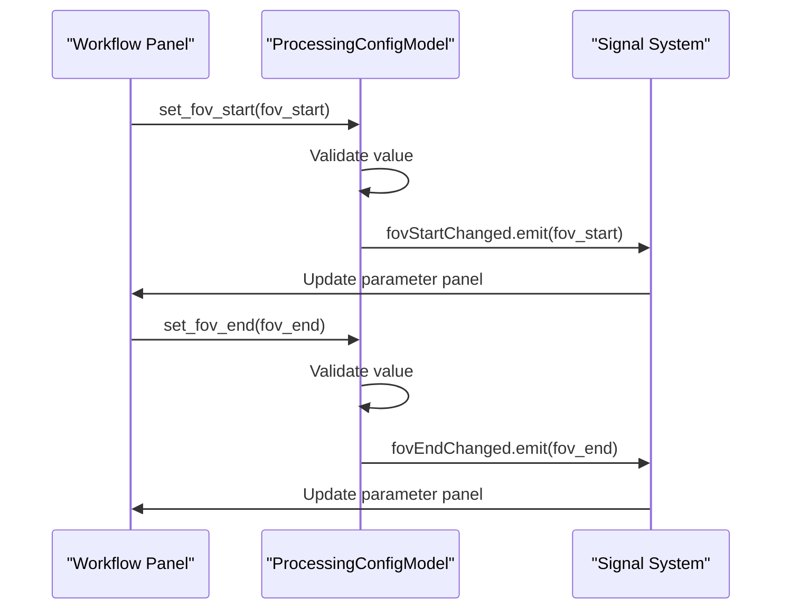
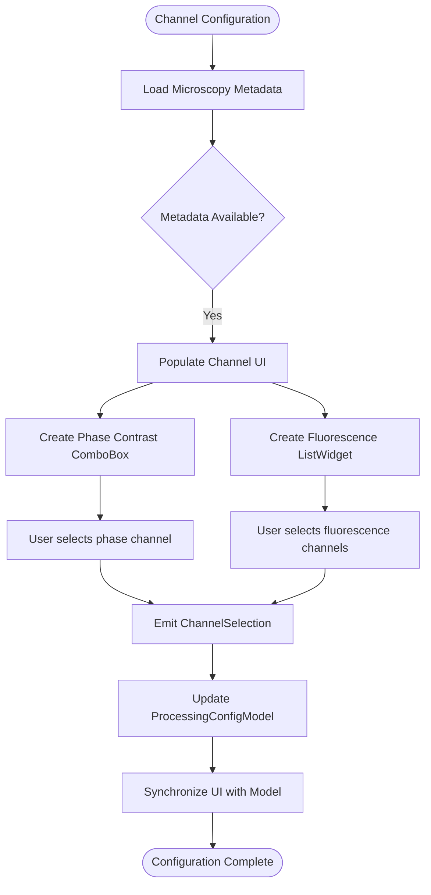
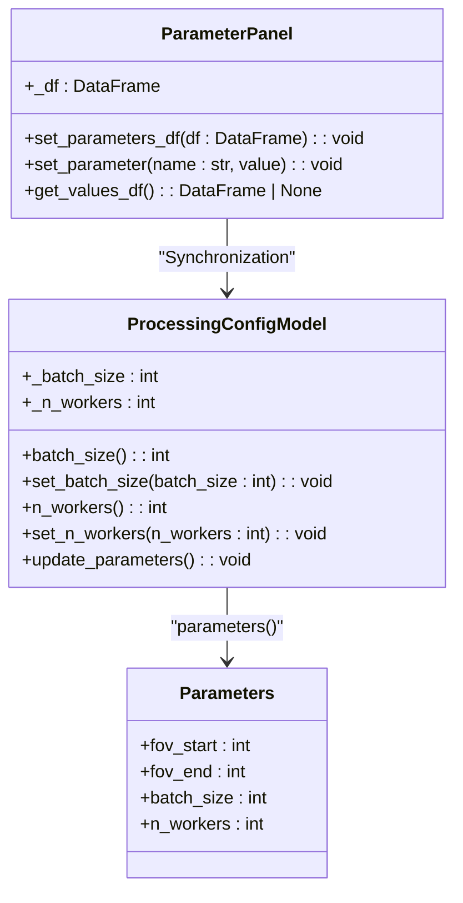
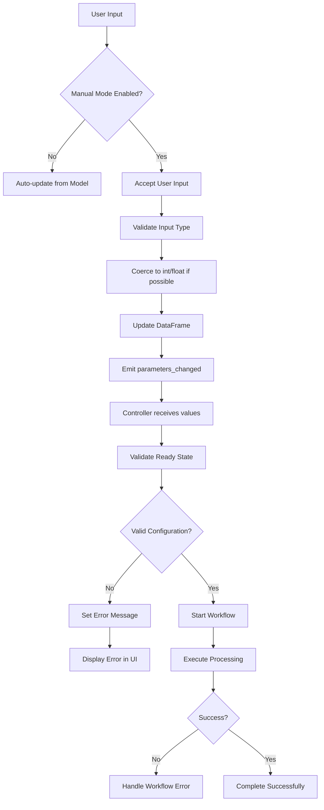

# Workflow Configuration

<cite>
**Referenced Files in This Document**   
- [models.py](file://pyama-qt/src/pyama_qt/processing/models.py)
- [workflow_panel.py](file://pyama-qt/src/pyama_qt/processing/panels/workflow_panel.py)
- [parameter_panel.py](file://pyama-qt/src/pyama_qt/components/parameter_panel.py)
- [types.py](file://pyama-core/src/pyama_core/processing/workflow/services/types.py)
- [controller.py](file://pyama-qt/src/pyama_qt/processing/controller.py)
</cite>

## Table of Contents
1. [Introduction](#introduction)
2. [ProcessingContext Model](#processingcontext-model)
3. [User Interface for Parameter Configuration](#user-interface-for-parameter-configuration)
4. [Field of View (FOV) Range Configuration](#field-of-view-fov-range-configuration)
5. [Channel Mapping Configuration](#channel-mapping-configuration)
6. [Batch Size and Worker Count Settings](#batch-size-and-worker-count-settings)
7. [Parameter Validation and Error Handling](#parameter-validation-and-error-handling)
8. [Typical Configuration Examples](#typical-configuration-examples)
9. [Performance Optimization Guidance](#performance-optimization-guidance)

## Introduction
The Workflow Configuration sub-feature enables users to define processing parameters before executing microscopy analysis workflows. This system provides a comprehensive interface for configuring Field of View (FOV) ranges, channel mapping between phase contrast and fluorescence channels, batch processing size, and worker thread count. The configuration state is managed through the ProcessingContext model, which maintains all settings required for workflow execution. Users interact with a graphical interface to tune parameters, with real-time validation to prevent invalid configurations. This documentation details the configuration model, user interface components, validation logic, and optimization guidance for different experimental setups.

## ProcessingContext Model
The ProcessingContext model serves as the central data structure that holds all configuration state for workflow execution. It encapsulates output directory paths, channel selections, processing parameters, and results tracking in a unified object that is passed through the processing pipeline.

**Diagram sources**
- [types.py](file://pyama-core/src/pyama_core/processing/workflow/services/types.py#L45-L61)

**Section sources**
- [types.py](file://pyama-core/src/pyama_core/processing/workflow/services/types.py#L45-L61)

## User Interface for Parameter Configuration
The user interface for workflow configuration is implemented through the ProcessingConfigPanel, which provides a structured layout for setting all processing parameters. The interface is divided into input, channel, and output sections, with real-time synchronization between UI components and the underlying ProcessingConfigModel.

**Diagram sources**
- [workflow_panel.py](file://pyama-qt/src/pyama_qt/processing/panels/workflow_panel.py#L32-L328)
- [models.py](file://pyama-qt/src/pyama_qt/processing/models.py#L31-L188)

**Section sources**
- [workflow_panel.py](file://pyama-qt/src/pyama_qt/processing/panels/workflow_panel.py#L32-L328)
- [models.py](file://pyama-qt/src/pyama_qt/processing/models.py#L31-L188)

## Field of View (FOV) Range Configuration
The FOV range configuration allows users to specify which fields of view to process within a microscopy dataset. Users can define a start and end FOV index to process a subset of available data, enabling selective analysis of specific regions of interest.

The FOV range parameters are managed through the ProcessingConfigModel with dedicated methods for setting and retrieving values:

**Diagram sources**
- [models.py](file://pyama-qt/src/pyama_qt/processing/models.py#L138-L154)
- [workflow_panel.py](file://pyama-qt/src/pyama_qt/processing/panels/workflow_panel.py#L266-L272)

**Section sources**
- [models.py](file://pyama-qt/src/pyama_qt/processing/models.py#L138-L154)
- [workflow_panel.py](file://pyama-qt/src/pyama_qt/processing/panels/workflow_panel.py#L266-L272)

## Channel Mapping Configuration
Channel mapping enables users to configure which microscopy channels correspond to phase contrast and fluorescence imaging. The system supports single phase contrast channel selection and multiple fluorescence channel selection through an intuitive UI with ComboBox and ListWidget components.

**Diagram sources**
- [workflow_panel.py](file://pyama-qt/src/pyama_qt/processing/panels/workflow_panel.py#L282-L315)
- [models.py](file://pyama-qt/src/pyama_qt/processing/models.py#L110-L127)

**Section sources**
- [workflow_panel.py](file://pyama-qt/src/pyama_qt/processing/panels/workflow_panel.py#L282-L315)
- [models.py](file://pyama-qt/src/pyama_qt/processing/models.py#L110-L127)

## Batch Size and Worker Count Settings
The batch size and worker count parameters control the parallelization strategy for processing workflows. Batch size determines how many FOVs are processed together in a single operation, while worker count specifies the number of concurrent processing threads.

**Diagram sources**
- [models.py](file://pyama-qt/src/pyama_qt/processing/models.py#L24-L28)
- [models.py](file://pyama-qt/src/pyama_qt/processing/models.py#L31-L188)
- [parameter_panel.py](file://pyama-qt/src/pyama_qt/components/parameter_panel.py#L22-L220)

**Section sources**
- [models.py](file://pyama-qt/src/pyama_qt/processing/models.py#L24-L28)
- [models.py](file://pyama-qt/src/pyama_qt/processing/models.py#L31-L188)
- [parameter_panel.py](file://pyama-qt/src/pyama_qt/components/parameter_panel.py#L22-L220)

## Parameter Validation and Error Handling
The system implements comprehensive validation logic to prevent invalid parameter combinations and provide meaningful error messages. Validation occurs at multiple levels, including UI input validation and workflow startup validation.

**Diagram sources**
- [controller.py](file://pyama-qt/src/pyama_qt/processing/controller.py#L384-L424)
- [workflow_panel.py](file://pyama-qt/src/pyama_qt/processing/panels/workflow_panel.py#L208-L220)

**Section sources**
- [controller.py](file://pyama-qt/src/pyama_qt/processing/controller.py#L384-L424)
- [workflow_panel.py](file://pyama-qt/src/pyama_qt/processing/panels/workflow_panel.py#L208-L220)

## Typical Configuration Examples
The following examples illustrate common configuration patterns for different experimental setups:

### High-Throughput Screening Setup
- **FOV Range**: Process all available FOVs (fov_start=0, fov_end=-1)
- **Channel Mapping**: Phase contrast channel 0, fluorescence channels [1,2,3]
- **Batch Size**: 4 (optimized for GPU memory)
- **Worker Count**: 8 (matching CPU core count)
- **Use Case**: Large-scale drug screening with multiple fluorescence markers

### Time-Lapse Imaging Setup
- **FOV Range**: Specific FOVs of interest (fov_start=5, fov_end=15)
- **Channel Mapping**: Phase contrast channel 0, fluorescence channel [1]
- **Batch Size**: 1 (ensuring temporal consistency)
- **Worker Count**: 4 (balanced CPU usage)
- **Use Case**: Long-term cell behavior monitoring

### Single-Cell Analysis Setup
- **FOV Range**: Single FOV analysis (fov_start=10, fov_end=10)
- **Channel Mapping**: Phase contrast channel 0, fluorescence channels [1,2]
- **Batch Size**: 1 (precision processing)
- **Worker Count**: 2 (minimal resource usage)
- **Use Case**: Detailed single-cell dynamics study

**Section sources**
- [models.py](file://pyama-qt/src/pyama_qt/processing/models.py#L31-L188)
- [controller.py](file://pyama-qt/src/pyama_qt/processing/controller.py#L384-L424)

## Performance Optimization Guidance
Selecting optimal values for batch size and worker count depends on both dataset characteristics and hardware capabilities. The following guidelines help users balance performance and accuracy:

### Hardware-Based Recommendations
- **CPU Cores**: Set worker count to 75% of available CPU cores to avoid system overload
- **RAM Capacity**: Ensure sufficient memory for batch processing (minimum 4GB per worker)
- **GPU Availability**: Use larger batch sizes when GPU acceleration is available
- **Storage Speed**: Use smaller batch sizes for slower storage systems to reduce I/O bottlenecks

### Dataset-Based Recommendations
- **Small Datasets** (<100 FOVs): Use batch size 1-2 and worker count 2-4
- **Medium Datasets** (100-1000 FOVs): Use batch size 2-4 and worker count 4-8
- **Large Datasets** (>1000 FOVs): Use batch size 4-8 and worker count 8-16

### Performance Monitoring
Users should monitor system resource usage during processing and adjust parameters accordingly:
- High CPU utilization (>80%): Consider reducing worker count
- High memory usage (>90%): Reduce batch size
- Low CPU utilization (<50%): Increase worker count or batch size
- I/O bottlenecks: Reduce batch size to decrease concurrent file access

**Section sources**
- [models.py](file://pyama-qt/src/pyama_qt/processing/models.py#L31-L188)
- [controller.py](file://pyama-qt/src/pyama_qt/processing/controller.py#L384-L424)