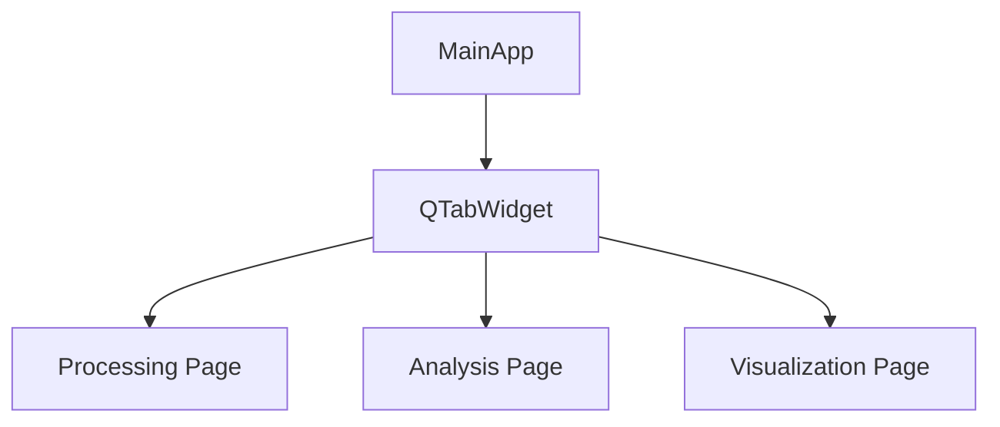
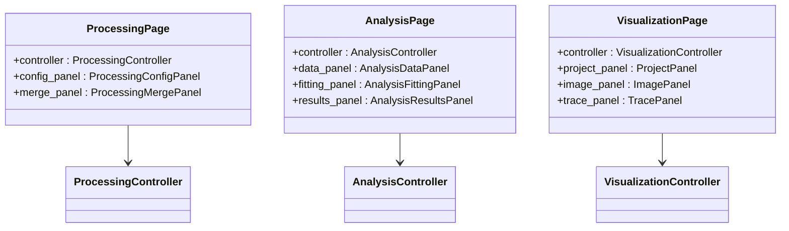
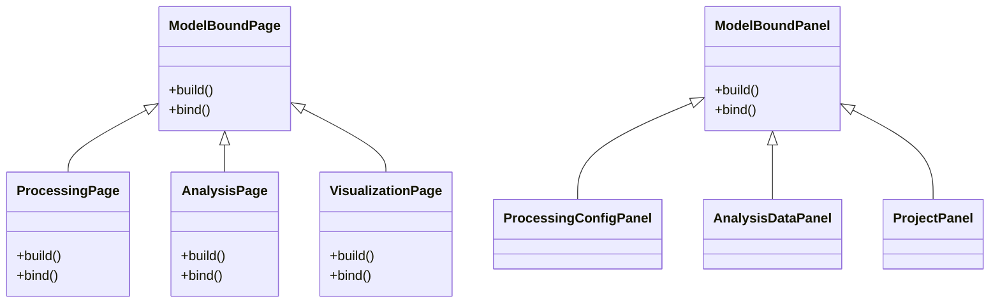
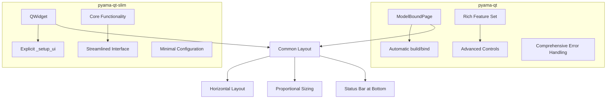
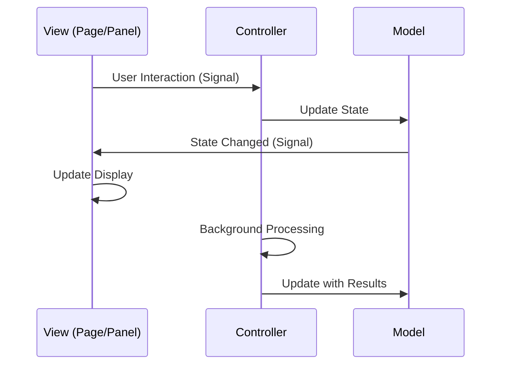
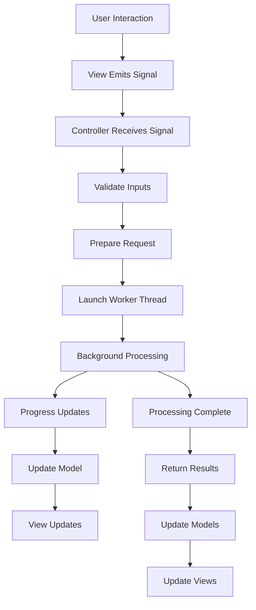

# User Interface Overview

<cite>
**Referenced Files in This Document**   
- [main.py](file://pyama-qt/src/pyama_qt/main.py)
- [page.py](file://pyama-qt/src/pyama_qt/processing/page.py)
- [page.py](file://pyama-qt/src/pyama_qt/analysis/page.py)
- [page.py](file://pyama-qt/src/pyama_qt/visualization/page.py)
- [page.py](file://pyama-qt-slim/src/pyama_qt/app/processing/page.py)
- [page.py](file://pyama-qt-slim/src/pyama_qt/app/analysis/page.py)
- [page.py](file://pyama-qt-slim/src/pyama_qt/app/visualization/page.py)
- [controller.py](file://pyama-qt/src/pyama_qt/processing/controller.py)
- [controller.py](file://pyama-qt/src/pyama_qt/analysis/controller.py)
- [controller.py](file://pyama-qt/src/pyama_qt/visualization/controller.py)
- [base.py](file://pyama-qt/src/pyama_qt/ui/base.py)
</cite>

## Table of Contents
1. [Main Application Window Structure](#main-application-window-structure)
2. [Top-Level Pages and Navigation](#top-level-pages-and-navigation)
3. [Shared UI Components](#shared-ui-components)
4. [Layout Principles in pyama-qt and pyama-qt-slim](#layout-principles-in-pyama-qt-and-pyama-qt-slim)
5. [MVC Architecture Implementation](#mvc-architecture-implementation)
6. [Event Flow from User Interaction to Background Processing](#event-flow-from-user-interaction-to-background-processing)
7. [Responsive Design and Accessibility](#responsive-design-and-accessibility)
8. [UI Customization and Theming Guidelines](#ui-customization-and-theming-guidelines)

## Main Application Window Structure

The main application window is structured as a tabbed interface with three primary pages: Processing, Analysis, and Visualization. The tab widget is positioned at the top of the window with a native, flatter appearance without custom styles. The application window is initialized with a size of 1600x640 pixels, providing ample space for the complex UI components in each tab.

The tab order is fixed as Processing, Analysis, and Visualization, with tabs being non-movable and non-closable to maintain a consistent user experience. Each tab contains a dedicated page that serves as a container for specialized panels relevant to that workflow stage. The central widget of the main window is the tab widget, which manages the display of these three primary pages.

**Diagram sources**
- [main.py](file://pyama-qt/src/pyama_qt/main.py#L1-L74)

**Section sources**
- [main.py](file://pyama-qt/src/pyama_qt/main.py#L1-L74)

## Top-Level Pages and Navigation

The application features three top-level pages accessible through bottom tabs, each serving a distinct purpose in the microscopy data processing workflow:

1. **Processing Page**: The entry point for workflow management, allowing users to configure and execute image processing pipelines. This page provides tools for loading microscopy files, selecting channels, configuring processing parameters, and managing sample assignments.

2. **Analysis Page**: Dedicated to data analysis tasks, this page enables users to load CSV data, perform curve fitting with various models, and view statistical results. It supports both batch processing and individual cell visualization.

3. **Visualization Page**: Designed for interactive data exploration, this page combines image viewing with trace visualization, allowing users to correlate spatial information with temporal intensity profiles.

Navigation between these pages is accomplished through direct tab selection, with each page maintaining its state independently. When a user switches tabs, the previously selected page's state is preserved, allowing for seamless context switching between processing, analysis, and visualization tasks.

**Diagram sources**
- [page.py](file://pyama-qt/src/pyama_qt/processing/page.py#L13-L81)
- [page.py](file://pyama-qt/src/pyama_qt/analysis/page.py#L17-L63)
- [page.py](file://pyama-qt/src/pyama_qt/visualization/page.py#L19-L118)

**Section sources**
- [page.py](file://pyama-qt/src/pyama_qt/processing/page.py#L13-L81)
- [page.py](file://pyama-qt/src/pyama_qt/analysis/page.py#L17-L63)
- [page.py](file://pyama-qt/src/pyama_qt/visualization/page.py#L19-L118)

## Shared UI Components

Several shared UI components are consistently implemented across all pages to provide a cohesive user experience:

- **Status Bar**: A QStatusBar is present on each page, providing real-time feedback about the current operation status, progress messages, and error notifications. The status bar is positioned at the bottom of each page layout.

- **Panel Architecture**: Each page is composed of specialized panels that encapsulate specific functionality. These panels follow a consistent design pattern with grouped controls and dedicated visualization areas.

- **Model-View-Controller Pattern**: All UI components leverage the MVC architecture through the ModelBoundPage and ModelBoundPanel base classes, ensuring separation of concerns between data, presentation, and logic.

- **Signal-Slot Mechanism**: Qt's signal-slot system is used extensively for inter-component communication, allowing panels to emit signals that are handled by controllers, which in turn update models and trigger view updates.

These shared components ensure consistency in user interaction patterns across the application, reducing the learning curve when navigating between different functional areas.

**Diagram sources**
- [base.py](file://pyama-qt/src/pyama_qt/ui/base.py#L12-L43)

**Section sources**
- [base.py](file://pyama-qt/src/pyama_qt/ui/base.py#L12-L43)

## Layout Principles in pyama-qt and pyama-qt-slim

The pyama-qt and pyama-qt-slim applications implement different layout principles reflecting their respective complexity and feature density:

**pyama-qt (Full-Featured Version)**:
- Uses the ModelBoundPage base class that automatically calls build() and bind() methods
- Implements a more sophisticated event handling system with comprehensive error handling
- Features a richer set of interactive controls and real-time feedback mechanisms
- Includes advanced configuration options and parameter management

**pyama-qt-slim (Lightweight Version)**:
- Uses a simpler QWidget-based approach with explicit _setup_ui() method calls
- Maintains the same three-panel layout but with reduced functionality
- Focuses on core functionality with minimal configuration options
- Provides a streamlined interface optimized for quick operations

Both versions maintain the same fundamental layout structure with horizontal layouts dividing the page into multiple panels with proportional sizing (using stretch factors). The status bar is consistently positioned at the bottom across all pages in both applications.

**Section sources**
- [page.py](file://pyama-qt/src/pyama_qt/processing/page.py#L13-L81)
- [page.py](file://pyama-qt-slim/src/pyama_qt/app/processing/page.py#L8-L24)

## MVC Architecture Implementation

The application implements a strict Model-View-Controller (MVC) architecture to separate concerns and facilitate maintainability:

- **Models**: Represent the application state and business logic. Each page has dedicated models (e.g., ProcessingConfigModel, AnalysisDataModel, ProjectModel) that emit signals when their state changes.

- **Views**: Comprise the UI components (pages and panels) that display data from models and capture user input. Views subscribe to model signals to update their presentation automatically.

- **Controllers**: Act as intermediaries between models and views, handling user interactions from views, updating models accordingly, and orchestrating background operations.

The ModelBoundPage and ModelBoundPanel base classes enforce this pattern by requiring concrete implementations of build() and bind() methods. The build() method constructs the UI components, while the bind() method establishes the connections between view signals and controller methods, as well as between models and view updates.

This architecture enables loose coupling between components, allowing for independent development and testing of each layer. It also facilitates state persistence and enables features like undo/redo functionality in future enhancements.

**Section sources**
- [controller.py](file://pyama-qt/src/pyama_qt/processing/controller.py#L333-L603)
- [controller.py](file://pyama-qt/src/pyama_qt/analysis/controller.py#L21-L135)
- [controller.py](file://pyama-qt/src/pyama_qt/visualization/controller.py#L32-L266)

## Event Flow from User Interaction to Background Processing

The event flow follows a consistent pattern across all pages, beginning with user interaction and culminating in background processing:

1. **User Interaction**: The user performs an action (e.g., clicking a button, changing a parameter) in a view component (panel).

2. **Signal Emission**: The view emits a signal corresponding to the user action (e.g., process_requested, csv_selected, visualization_requested).

3. **Controller Handling**: The controller's bind() method has connected these signals to appropriate handler methods, which validate inputs and prepare processing requests.

4. **Background Execution**: The controller launches a worker thread to perform the computationally intensive task, preventing UI freezing.

5. **Progress Updates**: The worker emits progress signals that the controller relays to the model, which in turn updates the view (e.g., status bar messages).

6. **Result Processing**: Upon completion, the worker returns results to the controller, which updates the appropriate models.

7. **View Update**: Model state changes trigger signals that update the relevant views, completing the cycle.

This event flow ensures responsive UI performance while handling potentially long-running operations, with proper error handling and user feedback at each stage.

**Section sources**
- [controller.py](file://pyama-qt/src/pyama_qt/processing/controller.py#L333-L603)
- [controller.py](file://pyama-qt/src/pyama_qt/analysis/controller.py#L21-L135)
- [controller.py](file://pyama-qt/src/pyama_qt/visualization/controller.py#L32-L266)

## Responsive Design and Accessibility

The application incorporates several responsive design and accessibility features:

- **Flexible Layouts**: QHBoxLayout and proportional sizing (using stretch factors) ensure that UI components resize appropriately when the window is resized.

- **Consistent Navigation**: The tabbed interface provides predictable navigation between major functional areas, with visual indication of the current page.

- **Status Feedback**: The status bar provides immediate feedback for all operations, including success messages, progress indicators, and error notifications.

- **Input Validation**: Form fields and parameter inputs include validation to prevent invalid configurations and provide helpful error messages.

- **Keyboard Navigation**: Qt's built-in keyboard navigation support allows users to navigate controls using tab and arrow keys.

- **High Contrast Elements**: UI elements use high-contrast colors and clear typography to enhance readability.

- **Error Recovery**: The application provides clear error messages and recovery options, allowing users to correct mistakes without losing their work.

These features ensure that the application is usable across different screen sizes and accessible to users with varying abilities and preferences.

**Section sources**
- [main.py](file://pyama-qt/src/pyama_qt/main.py#L1-L74)
- [page.py](file://pyama-qt/src/pyama_qt/processing/page.py#L13-L81)

## UI Customization and Theming Guidelines

While the current implementation uses Qt's native styling for a clean, platform-appropriate appearance, the architecture supports future customization and theming:

- **Style Separation**: The MVC pattern ensures that visual presentation is separated from business logic, making it easier to modify the UI without affecting functionality.

- **Component Reusability**: Panels are designed as reusable components that can be reconfigured or replaced with alternative implementations.

- **Configuration Files**: The presence of config.yaml suggests potential for theme and preference storage.

- **Extensible Architecture**: The modular design allows for the addition of new panels, pages, or entire feature sets without disrupting existing functionality.

For developers extending the UI, the following guidelines are recommended:

1. Inherit from ModelBoundPanel when creating new UI components to maintain consistency with the existing architecture.

2. Use signals and slots for inter-component communication rather than direct method calls.

3. Keep business logic in controllers and models, not in view components.

4. Follow the existing naming conventions and directory structure.

5. Ensure new components integrate with the status bar for user feedback.

6. Implement responsive layouts that adapt to different window sizes.

These guidelines ensure that UI extensions maintain the application's overall consistency and quality.

**Section sources**
- [base.py](file://pyama-qt/src/pyama_qt/ui/base.py#L12-L43)
- [config.yaml](file://pyama-qt/src/pyama_qt/config.yaml)