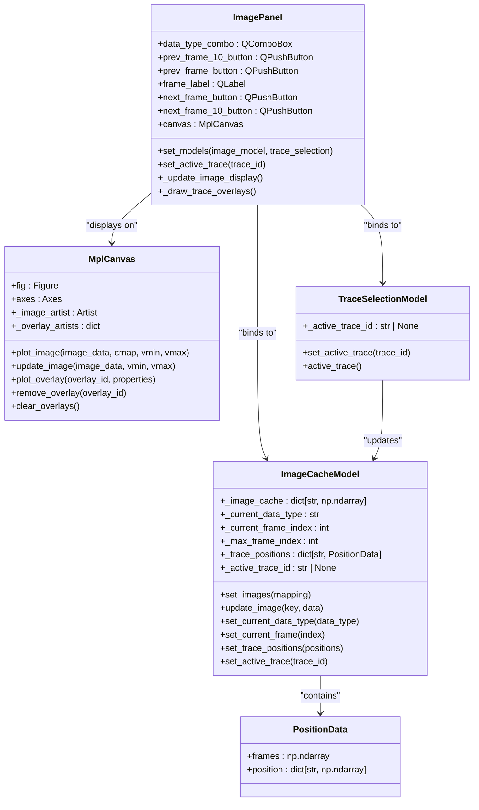
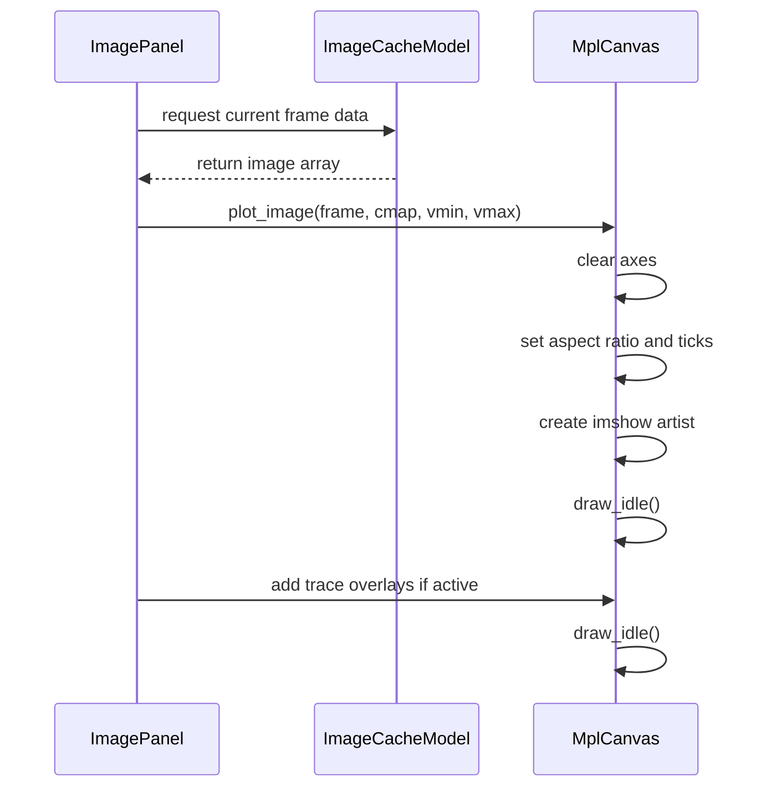
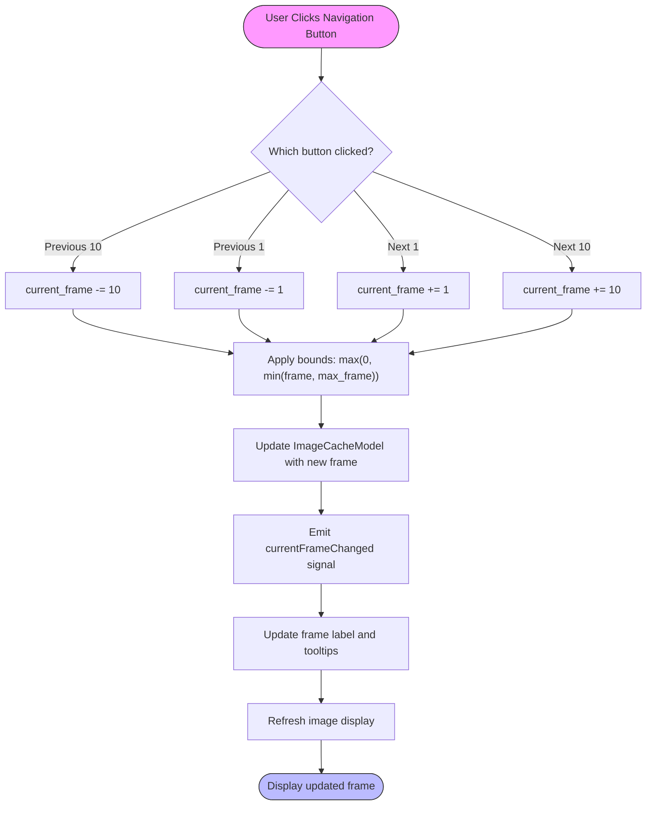
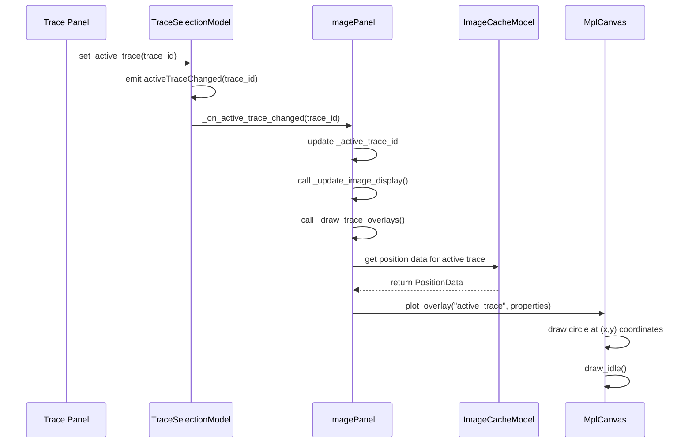

# Image Viewing

<cite>
**Referenced Files in This Document**   
- [image_panel.py](file://pyama-qt/src/pyama_qt/visualization/panels/image_panel.py)
- [mpl_canvas.py](file://pyama-qt/src/pyama_qt/components/mpl_canvas.py)
- [models.py](file://pyama-qt/src/pyama_qt/visualization/models.py)
- [processing_csv.py](file://pyama-core/src/pyama_core/io/processing_csv.py)
</cite>

## Table of Contents
1. [Introduction](#introduction)
2. [Core Components](#core-components)
3. [Image Rendering and Data Display](#image-rendering-and-data-display)
4. [Time-Series Playback Controls](#time-series-playback-controls)
5. [Channel Visibility and Data Type Selection](#channel-visibility-and-data-type-selection)
6. [Contrast Adjustment and Image Scaling](#contrast-adjustment-and-image-scaling)
7. [Zoom, Pan, and Navigation Gestures](#zoom-pan-and-navigation-gestures)
8. [Synchronization with Trace Visualization](#synchronization-with-trace-visualization)
9. [Multi-Channel Time-Series Analysis](#multi-channel-time-series-analysis)
10. [Performance Optimization for Large Datasets](#performance-optimization-for-large-datasets)
11. [Image Export and Annotation](#image-export-and-annotation)

## Introduction
The Image Viewing sub-feature provides an interactive interface for visualizing multi-channel, time-series microscopy data. This system enables researchers to explore raw image data alongside processed results such as segmentation masks and cell tracking overlays. Built on a matplotlib integration via the `mpl_canvas` component, the viewer supports comprehensive analysis of dynamic cellular processes across time. The interface synchronizes with trace visualization components, allowing users to correlate spatial image data with temporal feature measurements. Designed for both phase contrast and fluorescence microscopy modalities, the viewer accommodates various experimental setups and imaging protocols.

## Core Components
The image viewing functionality is implemented through several interconnected components that manage data flow, visualization, and user interaction. The system architecture follows a model-view-controller pattern, with specialized models handling image data caching and trace position management, while view components render the visual elements and respond to user inputs.

**Diagram sources**
- [image_panel.py](file://pyama-qt/src/pyama_qt/visualization/panels/image_panel.py#L1-L308)
- [mpl_canvas.py](file://pyama-qt/src/pyama_qt/components/mpl_canvas.py#L1-L201)
- [models.py](file://pyama-qt/src/pyama_qt/visualization/models.py#L229-L397)

**Section sources**
- [image_panel.py](file://pyama-qt/src/pyama_qt/visualization/panels/image_panel.py#L1-L308)
- [mpl_canvas.py](file://pyama-qt/src/pyama_qt/components/mpl_canvas.py#L1-L201)
- [models.py](file://pyama-qt/src/pyama_qt/visualization/models.py#L229-L397)

## Image Rendering and Data Display
The image panel renders microscopy data by integrating matplotlib visualization within a Qt application through the `MplCanvas` component. This approach enables high-quality rendering of both raw image data and processed results such as segmentation masks and tracking overlays. The system supports multi-channel, time-series data by maintaining separate data types in the `ImageCacheModel`, which stores numpy arrays for different modalities including raw images, segmentation results, and tracking data.

When displaying images, the system automatically determines appropriate scaling by calculating the minimum and maximum values across the entire dataset, ensuring consistent contrast across frames. For segmentation data, the viewer uses a 'viridis' colormap to distinguish different cellular regions, while fluorescence and phase contrast channels are displayed using a grayscale colormap. The current frame index and data type are reflected in the plot title, providing immediate context for the displayed image.

**Diagram sources**
- [image_panel.py](file://pyama-qt/src/pyama_qt/visualization/panels/image_panel.py#L198-L254)
- [mpl_canvas.py](file://pyama-qt/src/pyama_qt/components/mpl_canvas.py#L44-L89)

**Section sources**
- [image_panel.py](file://pyama-qt/src/pyama_qt/visualization/panels/image_panel.py#L198-L254)
- [mpl_canvas.py](file://pyama-qt/src/pyama_qt/components/mpl_canvas.py#L44-L89)

## Time-Series Playback Controls
The viewer provides intuitive controls for navigating through time-series microscopy data, enabling users to examine cellular dynamics across multiple frames. The playback interface includes single-frame navigation buttons ("<" and ">") as well as accelerated navigation controls ("<<" and ">>") that move forward or backward by 10 frames at a time. These controls are implemented as QPushButton widgets connected to event handlers that update the current frame index in the `ImageCacheModel`.

Frame navigation is managed through the `set_current_frame` method of the `ImageCacheModel`, which ensures that the requested frame index remains within valid bounds (0 to maximum frame index). The current frame position is displayed in a QLabel that updates automatically whenever the frame changes, showing the format "Frame X/Y" where X is the current frame and Y is the total number of frames minus one. Tooltips on the navigation buttons provide contextual feedback, indicating when the user has reached the beginning or end of the time series.

**Diagram sources**
- [image_panel.py](file://pyama-qt/src/pyama_qt/visualization/panels/image_panel.py#L112-L165)
- [models.py](file://pyama-qt/src/pyama_qt/visualization/models.py#L348-L365)

**Section sources**
- [image_panel.py](file://pyama-qt/src/pyama_qt/visualization/panels/image_panel.py#L112-L165)
- [models.py](file://pyama-qt/src/pyama_qt/visualization/models.py#L348-L365)

## Channel Visibility and Data Type Selection
Users can switch between different data types (such as raw images, segmentation masks, and tracking results) using a QComboBox widget labeled "Data Type". This selection control is populated dynamically based on the available data types in the `ImageCacheModel`, which maintains a dictionary of numpy arrays keyed by data type identifiers. When a new data type is selected, the `ImagePanel` updates the `ImageCacheModel` to reflect the current selection, triggering a display refresh.

The data type selection mechanism supports both programmatic and user-driven changes. When the underlying data model changes (for example, when new processing results are added), the `dataTypeAdded` signal notifies the `ImagePanel` to update the combo box options. Similarly, when the current data type changes programmatically (such as when loading a new dataset), the `_on_current_data_type` handler ensures the UI reflects the correct selection. This bidirectional synchronization prevents UI/model inconsistencies and provides a responsive user experience.

**Section sources**
- [image_panel.py](file://pyama-qt/src/pyama_qt/visualization/panels/image_panel.py#L100-L111)
- [models.py](file://pyama-qt/src/pyama_qt/visualization/models.py#L294-L303)

## Contrast Adjustment and Image Scaling
The image viewer automatically calculates optimal contrast settings by analyzing the intensity distribution across the entire dataset. For each data type, the system computes the global minimum and maximum values, which are then used as the `vmin` and `vmax` parameters when displaying the image through matplotlib's `imshow` function. This approach ensures consistent brightness and contrast across all frames in a time series, facilitating visual comparison of cellular features over time.

For non-segmentation data types (such as phase contrast and fluorescence channels), the viewer uses the actual data range rather than a fixed 0-255 scale, preserving the quantitative intensity information. Segmentation data is displayed using discrete colormap scaling to clearly distinguish different cellular regions. The contrast settings are recalculated whenever the data type changes or new image data is loaded, ensuring that the display always reflects the current dataset's characteristics.

**Section sources**
- [image_panel.py](file://pyama-qt/src/pyama_qt/visualization/panels/image_panel.py#L208-L223)
- [mpl_canvas.py](file://pyama-qt/src/pyama_qt/components/mpl_canvas.py#L44-L89)

## Zoom, Pan, and Navigation Gestures
The image viewer supports interactive navigation through standard matplotlib navigation tools integrated into the `MplCanvas` component. Users can zoom into regions of interest using the zoom tool, which allows rectangular selection of areas to magnify. Panning is supported through click-and-drag gestures, enabling users to explore different parts of the image while zoomed in. These navigation features are implemented through matplotlib's built-in navigation toolbar, which provides intuitive controls for manipulating the view.

The canvas maintains a consistent aspect ratio during navigation to preserve the spatial relationships within the microscopy image. Coordinate axes are hidden to maximize the viewing area, but the pixel coordinates of the cursor position are typically displayed in the status bar or figure toolbar. The navigation state (zoom level and pan position) is preserved across frame changes, allowing users to focus on specific regions throughout the time series without needing to re-navigate for each frame.

**Section sources**
- [mpl_canvas.py](file://pyama-qt/src/pyama_qt/components/mpl_canvas.py#L44-L89)

## Synchronization with Trace Visualization
The image viewer maintains tight synchronization with trace visualization components through shared models and signal-slot connections. The `TraceSelectionModel` tracks the currently active trace ID, which is shared between the image panel and trace visualization panels. When a user selects a different cell trace in the analysis interface, the `activeTraceChanged` signal propagates to the `ImagePanel`, triggering an update of the tracking overlay.

The `ImageCacheModel` contains position data for all tracked cells, stored as `PositionData` objects that map frame indices to x,y coordinates. During each frame update, the viewer checks if the current frame has a recorded position for the active trace and, if so, draws a circular overlay at the corresponding location. This synchronization enables users to follow individual cells across time while simultaneously viewing their quantitative feature measurements in linked trace visualization panels.

**Diagram sources**
- [image_panel.py](file://pyama-qt/src/pyama_qt/visualization/panels/image_panel.py#L255-L284)
- [models.py](file://pyama-qt/src/pyama_qt/visualization/models.py#L366-L375)

**Section sources**
- [image_panel.py](file://pyama-qt/src/pyama_qt/visualization/panels/image_panel.py#L255-L284)
- [models.py](file://pyama-qt/src/pyama_qt/visualization/models.py#L366-L375)

## Multi-Channel Time-Series Analysis
The viewer supports comparative analysis of different microscopy channels, such as phase contrast and fluorescence, across time points. Users can switch between channels using the data type selection combobox, which displays all available channel types loaded into the `ImageCacheModel`. This enables side-by-side comparison of cellular morphology (visible in phase contrast) with specific molecular markers (visible in fluorescence channels).

For experiments with multiple fluorescence channels, the system can display each channel as a separate data type, allowing users to examine co-localization patterns or differential expression across time. The frame synchronization ensures that when navigating through time, all channels advance in lockstep, maintaining temporal alignment between different modalities. This capability is particularly valuable for studying dynamic processes such as protein translocation or cell cycle progression.

**Section sources**
- [image_panel.py](file://pyama-qt/src/pyama_qt/visualization/panels/image_panel.py#L100-L111)
- [models.py](file://pyama-qt/src/pyama_qt/visualization/models.py#L229-L397)

## Performance Optimization for Large Datasets
The image viewing system implements several performance optimizations to handle large Z-stack or high-frame-rate datasets efficiently. The `ImageCacheModel` serves as a central data repository that pre-loads and caches processed image data, reducing the need for repeated computation or file I/O during navigation. For extremely large datasets, the system could be extended with downsampling strategies that load lower-resolution versions of images for interactive viewing, switching to full resolution only when needed.

Memory usage is managed through careful data structure design, with numpy arrays providing efficient storage of image data. The viewer updates only the image data when changing frames, rather than recreating the entire matplotlib artist, which significantly improves rendering performance. For time-series data, the system calculates the maximum frame index across all data types, ensuring consistent navigation bounds regardless of channel-specific frame counts.

The `load_trace_positions` method in `ImageCacheModel` demonstrates efficient data processing by extracting position information from a processing DataFrame only once and caching the results as `PositionData` objects. This approach minimizes computational overhead during interactive exploration, as position lookups become simple dictionary accesses rather than repeated DataFrame queries.

**Section sources**
- [models.py](file://pyama-qt/src/pyama_qt/visualization/models.py#L377-L397)
- [processing_csv.py](file://pyama-core/src/pyama_core/io/processing_csv.py#L148-L177)

## Image Export and Annotation
Users can export annotated images for presentations or publications through the matplotlib canvas's built-in export functionality. The `MplCanvas` component inherits matplotlib's standard image saving capabilities, allowing users to export the current view in various formats such as PNG, SVG, or PDF. The exported images include all visible elements: the base microscopy image, segmentation overlays, and any active tracking indicators.

For publication-quality figures, users can adjust the canvas DPI settings and figure size before export to meet specific resolution requirements. The title of the exported image automatically includes the current data type and frame index, providing essential metadata. Additional annotations can be added through matplotlib's text and shape drawing tools, either programmatically or via interactive plotting commands, enabling the creation of customized figures that highlight specific features of interest.

**Section sources**
- [mpl_canvas.py](file://pyama-qt/src/pyama_qt/components/mpl_canvas.py#L1-L201)