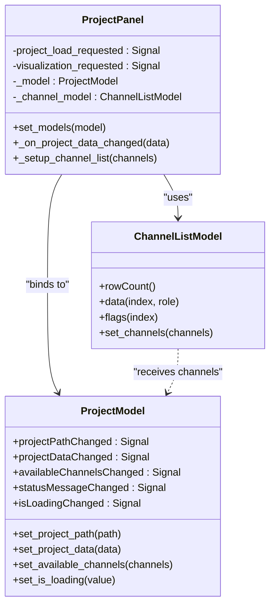
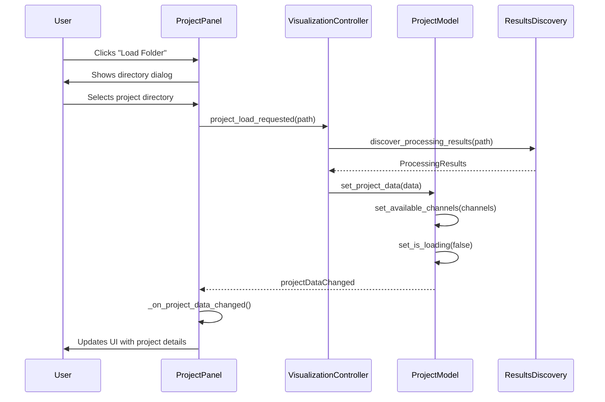
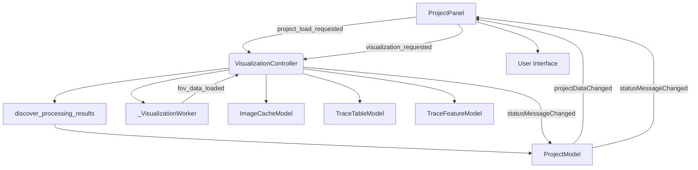

# Project Navigation

<cite>
**Referenced Files in This Document**   
- [project_panel.py](file://pyama-qt/src/pyama_qt/visualization/panels/project_panel.py)
- [controller.py](file://pyama-qt/src/pyama_qt/visualization/controller.py)
- [models.py](file://pyama-qt/src/pyama_qt/visualization/models.py)
- [results_yaml.py](file://pyama-core/src/pyama_core/io/results_yaml.py)
</cite>

## Table of Contents
1. [Introduction](#introduction)
2. [Project Panel Interface](#project-panel-interface)
3. [Model-View Architecture](#model-view-architecture)
4. [Project Loading Process](#project-loading-process)
5. [Selection State Management](#selection-state-management)
6. [Integration with VisualizationController](#integration-with-visualizationcontroller)
7. [Loading Existing Projects](#loading-existing-projects)
8. [Navigating Multiple FOVs](#navigating-multiple-fovs)
9. [Session State Restoration](#session-state-restoration)
10. [Common Issues and Troubleshooting](#common-issues-and-troubleshooting)
11. [Project Directory Organization](#project-directory-organization)

## Introduction
The Project Navigation sub-feature enables users to browse and select microscopy projects and fields of view (FOVs) within the PyAMA-Qt application. This system provides a structured interface for loading processed analysis results, navigating between multiple FOVs, and managing visualization settings. The architecture follows a model-view pattern where the ProjectPanel handles user interface interactions while delegating data management to the ProjectModel and VisualizationController. This documentation explains the complete workflow from project loading to visualization initiation, covering the underlying architecture, integration points, and practical usage patterns.

## Project Panel Interface
The ProjectPanel provides the primary user interface for project navigation and selection. It consists of two main sections: project loading and visualization settings. The loading section includes a "Load Folder" button that triggers directory selection through a file dialog, and a text area that displays detailed information about the loaded project including path, number of FOVs, available channels, time units, and available data types. The visualization settings section contains controls for selecting specific FOVs through a spinbox with range indicators, and a multi-selection list for choosing which channels to load. A "Start Visualization" button initiates the visualization process based on current selections, with a progress bar providing status feedback during loading operations.

**Section sources**
- [project_panel.py](file://pyama-qt/src/pyama_qt/visualization/panels/project_panel.py#L88-L335)

## Model-View Architecture
The project navigation system implements a clean model-view architecture that separates data management from user interface concerns. The ProjectModel class serves as the central data repository, maintaining project metadata and selection state through observable properties. It exposes signals such as projectDataChanged, availableChannelsChanged, and isLoadingChanged that notify views of state changes. The ProjectPanel acts as the view component, binding to the ProjectModel to receive updates and reflect them in the UI. This separation allows multiple components to respond to project state changes without direct dependencies. The ChannelListModel specifically manages the available channels list, providing a proper model-view implementation for the channel selection ListView with support for multi-selection and dynamic updates when new projects are loaded.

**Diagram sources**
- [models.py](file://pyama-qt/src/pyama_qt/visualization/models.py#L55-L227)
- [project_panel.py](file://pyama-qt/src/pyama_qt/visualization/panels/project_panel.py#L88-L335)
- [project_panel.py](file://pyama-qt/src/pyama_qt/visualization/panels/project_panel.py#L38-L85)

## Project Loading Process
The project loading process begins when the user selects a directory through the file dialog triggered by the "Load Folder" button. The selected path is emitted via the project_load_requested signal and handled by the VisualizationController. The controller uses the discover_processing_results function to analyze the directory structure and locate processed results. This function first checks for a processing_results.yaml file which contains metadata about the project structure; if not found, it falls back to directory-based discovery by scanning for FOV subdirectories. Once project data is discovered, the controller updates the ProjectModel with comprehensive metadata including the project path, number of FOVs, available channels, and time units. The ProjectModel then emits the projectDataChanged signal, which triggers the ProjectPanel to update its display with project details and configure the FOV selection range based on available data.

**Diagram sources**
- [controller.py](file://pyama-qt/src/pyama_qt/visualization/controller.py#L44-L75)
- [project_panel.py](file://pyama-qt/src/pyama_qt/visualization/panels/project_panel.py#L175-L205)
- [results_yaml.py](file://pyama-core/src/pyama_core/io/results_yaml.py#L63-L73)

## Selection State Management
The system maintains selection state through the ProjectModel which tracks the currently selected FOV index and available channels. When a project is loaded, the ProjectPanel automatically configures the FOV spinbox range based on the available FOV keys in the project data, displaying the maximum value next to the spinbox for user reference. The channel selection list is populated with all available data types from the first FOV's data, excluding the "traces" key which is not a visualization channel. The ChannelListModel ensures that user selections are preserved across operations by only initializing the channel list once per project load. When the user changes the FOV selection, the spinbox valueChanged signal triggers a reset of the visualization button text to indicate readiness. The system validates selections before visualization, checking that the selected FOV exists in the project data and that at least one channel is selected for loading.

**Section sources**
- [project_panel.py](file://pyama-qt/src/pyama_qt/visualization/panels/project_panel.py#L88-L335)
- [models.py](file://pyama-qt/src/pyama_qt/visualization/models.py#L55-L227)

## Integration with VisualizationController
The ProjectPanel integrates with the VisualizationController through a well-defined interface that coordinates project loading and visualization initiation. The controller acts as the central coordinator, receiving project load requests from the panel and managing the loading process through background workers. When the user clicks "Start Visualization", the ProjectPanel emits a visualization_requested signal with the current FOV index and selected channels, which is connected to the controller's start_visualization method. The controller then orchestrates the loading of FOV-specific data, updating the ProjectModel's isLoading state and status messages throughout the process. The controller also manages inter-component communication, such as passing the trace CSV path to the trace panel when available. This integration pattern ensures that the ProjectPanel remains focused on user interface concerns while delegating complex data management and loading operations to the controller.

**Diagram sources**
- [controller.py](file://pyama-qt/src/pyama_qt/visualization/controller.py#L44-L134)
- [project_panel.py](file://pyama-qt/src/pyama_qt/visualization/panels/project_panel.py#L88-L335)
- [page.py](file://pyama-qt/src/pyama_qt/visualization/page.py#L38-L71)

## Loading Existing Projects
To load an existing analysis project, users click the "Load Folder" button in the ProjectPanel and navigate to the directory containing processed results. The system supports two project organization patterns: projects with a processing_results.yaml file that contains metadata about the analysis, and projects organized by directory structure alone. When a YAML file is present, it provides comprehensive information about channels, time units, and file paths, even if the original files have been moved. The system automatically corrects file paths from the YAML to match the current directory structure. For projects without a YAML file, the system discovers FOVs by scanning for directories with names starting with "fov_". Once loaded, the project details are displayed in the text area, showing the project path, number of FOVs, channel information, time units, and available data types. The FOV selection range is automatically configured based on the discovered FOV indices.

**Section sources**
- [results_yaml.py](file://pyama-core/src/pyama_core/io/results_yaml.py#L63-L73)
- [controller.py](file://pyama-qt/src/pyama_qt/visualization/controller.py#L44-L75)

## Navigating Multiple FOVs
Navigating between multiple FOVs is accomplished through the FOV spinbox control in the ProjectPanel. The spinbox range is automatically set based on the minimum and maximum FOV indices found in the loaded project data, with the maximum value displayed next to the spinbox for reference. Users can change the selected FOV by clicking the spinbox arrows, typing a value directly, or using keyboard up/down arrows. When a new FOV is selected, the visualization button text resets to "Start Visualization" to indicate readiness. To visualize the selected FOV, users must first select one or more channels from the available channels list using standard multi-selection techniques (Ctrl+click for individual selection, Shift+click for range selection). Clicking "Start Visualization" then loads the selected channels for the current FOV, with progress updates displayed in the status bar. The system validates that the selected FOV exists in the project data before initiating visualization.

**Section sources**
- [project_panel.py](file://pyama-qt/src/pyama_qt/visualization/panels/project_panel.py#L88-L335)

## Session State Restoration
The system automatically restores relevant session state when loading projects and visualizing FOVs. When a project is loaded, the ProjectModel maintains the project path and data structure, allowing consistent access to all FOVs within the project. For visualization, the system automatically attempts to load trace data when available, checking first for an inspected version of the traces CSV file (with "_inspected" suffix) and falling back to the regular traces CSV if not found. This preserves any quality assessments made in previous sessions. The controller maintains references to all data models (image, trace table, trace features, and selection models), ensuring that state is preserved across visualization operations. While the current implementation does not save the complete application state between sessions, the project-based organization allows users to easily return to specific datasets and resume analysis from where they left off by simply reloading the project directory.

**Section sources**
- [controller.py](file://pyama-qt/src/pyama_qt/visualization/controller.py#L200-L266)
- [models.py](file://pyama-qt/src/pyama_qt/visualization/models.py#L229-L793)

## Common Issues and Troubleshooting
Several common issues may occur during project navigation and can be addressed through systematic troubleshooting. If no data is found when loading a directory, ensure that the selected folder contains subdirectories with names starting with "fov_" or a processing_results.yaml file. Directory permission errors can prevent file access; verify that the application has read permissions for the project directory and all subdirectories. Missing result files may occur if processing was incomplete or files were moved; the system attempts to correct paths from YAML files, but if files are missing, reprocessing may be necessary. If channels do not appear in the selection list, verify that the FOV directories contain NPY files with appropriate naming patterns. For performance issues with large datasets, consider organizing data into smaller projects or ensuring that only necessary channels are selected for visualization. The status messages in the progress bar provide real-time feedback about loading operations and can help identify specific issues.

**Section sources**
- [controller.py](file://pyama-qt/src/pyama_qt/visualization/controller.py#L73-L105)
- [results_yaml.py](file://pyama-core/src/pyama_core/io/results_yaml.py#L63-L73)

## Project Directory Organization
For optimal navigation performance and compatibility, organize project directories with a clear hierarchical structure. The root directory should contain either a processing_results.yaml file or subdirectories for each FOV named with the pattern "fov_XXX" where XXX is a zero-padded number (e.g., "fov_000", "fov_001"). Each FOV directory should contain NPY files for image data with descriptive names indicating the data type and channel (e.g., "phase_fov_000_ch_0.npy", "seg_fov_000_ch_1.npy"). Include a traces CSV file (preferably with an inspected version) containing cell tracking data. For large datasets, consider splitting analyses into multiple project directories rather than creating a single directory with many FOVs, as this improves loading performance and makes projects more manageable. The presence of a processing_results.yaml file significantly enhances project portability, as it contains metadata that allows the system to locate result files even if the directory structure has changed.

**Section sources**
- [results_yaml.py](file://pyama-core/src/pyama_core/io/results_yaml.py#L63-L73)
- [project_panel.py](file://pyama-qt/src/pyama_qt/visualization/panels/project_panel.py#L109-L146)