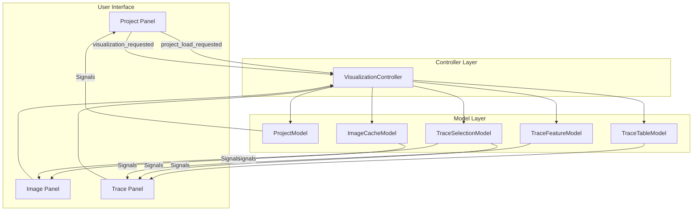
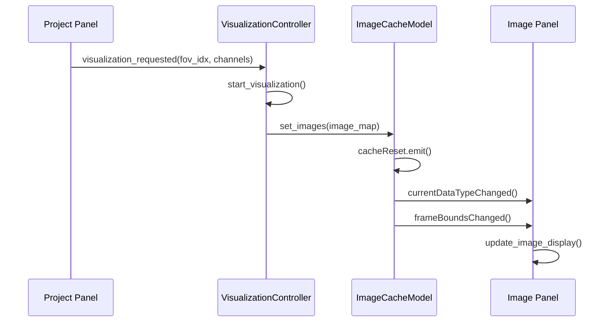
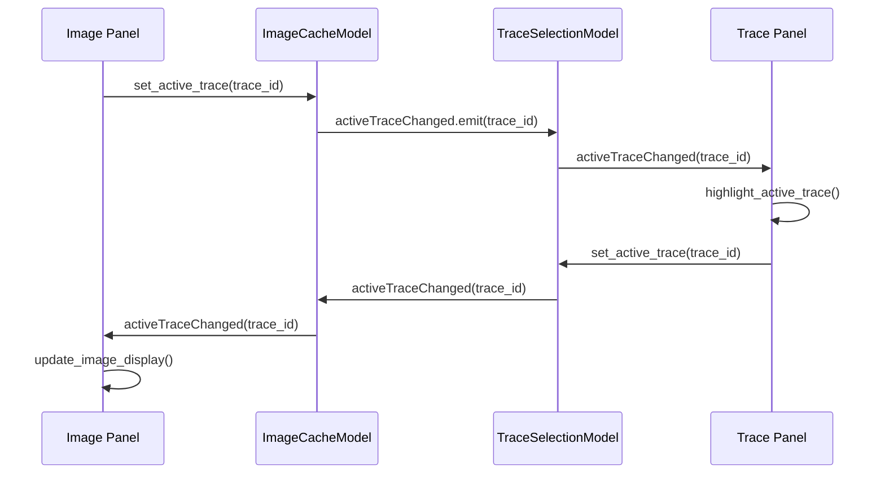
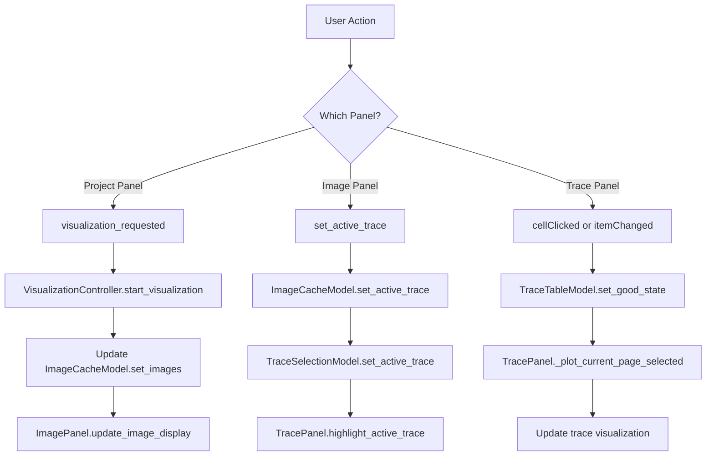
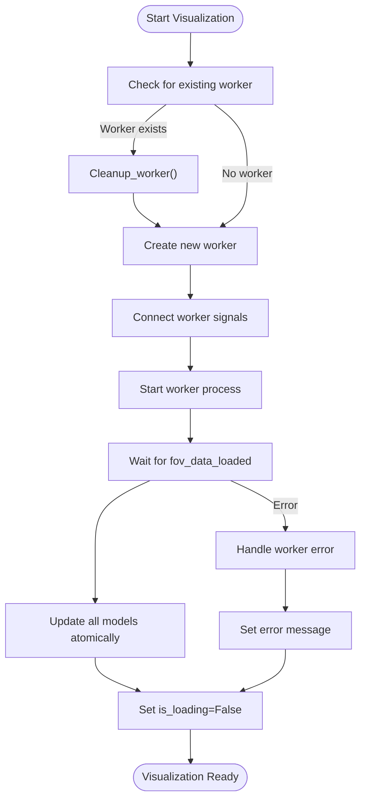

# Synchronized Selection

<cite>
**Referenced Files in This Document**   
- [controller.py](file://pyama-qt/src/pyama_qt/visualization/controller.py)
- [project_panel.py](file://pyama-qt/src/pyama_qt/visualization/panels/project_panel.py)
- [image_panel.py](file://pyama-qt/src/pyama_qt/visualization/panels/image_panel.py)
- [trace_panel.py](file://pyama-qt/src/pyama_qt/visualization/panels/trace_panel.py)
- [models.py](file://pyama-qt/src/pyama_qt/visualization/models.py)
</cite>

## Table of Contents
1. [Introduction](#introduction)
2. [Architecture Overview](#architecture-overview)
3. [Core Components](#core-components)
4. [Synchronization Workflow](#synchronization-workflow)
5. [Signal Propagation and Event Handling](#signal-propagation-and-event-handling)
6. [Race Condition Management](#race-condition-management)
7. [Debugging and Extension Guidelines](#debugging-and-extension-guidelines)
8. [Conclusion](#conclusion)

## Introduction
The Synchronized Selection sub-feature enables consistent state management across multiple visualization panels in the PyAMA-Qt application. This system ensures that user interactions in one panel automatically propagate to related panels, maintaining a coherent view of the dataset. The synchronization mechanism coordinates the project panel, image viewer, and trace analysis components through a centralized controller using Qt's signal-slot architecture. This document details the implementation, workflow, and technical considerations for this synchronization system.

## Architecture Overview

**Diagram sources**
- [controller.py](file://pyama-qt/src/pyama_qt/visualization/controller.py#L32-L266)
- [project_panel.py](file://pyama-qt/src/pyama_qt/visualization/panels/project_panel.py#L96-L97)
- [image_panel.py](file://pyama-qt/src/pyama_qt/visualization/panels/image_panel.py)
- [trace_panel.py](file://pyama-qt/src/pyama_qt/visualization/panels/trace_panel.py)
- [models.py](file://pyama-qt/src/pyama_qt/visualization/models.py)

**Section sources**
- [controller.py](file://pyama-qt/src/pyama_qt/visualization/controller.py#L32-L266)
- [models.py](file://pyama-qt/src/pyama_qt/visualization/models.py)

## Core Components

The synchronized selection system consists of several key components that work together to maintain consistent state across visualization panels. The VisualizationController serves as the central coordinator, managing data flow between the UI components and underlying data models. Each visualization panel (project, image, and trace) contains specialized logic for handling user interactions and displaying relevant data. The model layer stores the application state and emits signals when data changes, enabling reactive updates across the interface.

**Section sources**
- [controller.py](file://pyama-qt/src/pyama_qt/visualization/controller.py#L32-L266)
- [models.py](file://pyama-qt/src/pyama_qt/visualization/models.py)

## Synchronization Workflow

### Field of View Selection Propagation
When a user selects a field of view (FOV) in the project panel, the selection propagates through the system as follows:
1. The ProjectPanel emits a `visualization_requested` signal with the selected FOV index and channels
2. The VisualizationController receives this request and initiates loading of the specified FOV data
3. Upon successful loading, the controller updates the ImageCacheModel with new image data
4. The ImageCacheModel emits a `cacheReset` signal, triggering the ImagePanel to refresh its display
5. The ImagePanel automatically displays the first available data type for the selected FOV

**Diagram sources**
- [controller.py](file://pyama-qt/src/pyama_qt/visualization/controller.py#L83-L122)
- [models.py](file://pyama-qt/src/pyama_qt/visualization/models.py#L252-L262)
- [image_panel.py](file://pyama-qt/src/pyama_qt/visualization/panels/image_panel.py)

### Cell Selection Propagation
Cell selection synchronization occurs bidirectionally between the image and trace panels:
1. When a cell is clicked in the ImagePanel, it sets the active trace ID in the ImageCacheModel
2. The ImageCacheModel propagates this change to the TraceSelectionModel via signals
3. The TraceSelectionModel updates its state and emits an `activeTraceChanged` signal
4. The TracePanel receives this signal and highlights the corresponding trace in its plot
5. Conversely, when a trace is selected in the TracePanel, it updates the TraceSelectionModel
6. The change propagates back to the ImagePanel, which highlights the cell in the current frame

**Diagram sources**
- [controller.py](file://pyama-qt/src/pyama_qt/visualization/controller.py#L124-L127)
- [models.py](file://pyama-qt/src/pyama_qt/visualization/models.py#L788-L792)
- [image_panel.py](file://pyama-qt/src/pyama_qt/visualization/panels/image_panel.py)
- [trace_panel.py](file://pyama-qt/src/pyama_qt/visualization/panels/trace_panel.py)

**Section sources**
- [controller.py](file://pyama-qt/src/pyama_qt/visualization/controller.py#L124-L127)
- [image_panel.py](file://pyama-qt/src/pyama_qt/visualization/panels/image_panel.py)
- [trace_panel.py](file://pyama-qt/src/pyama_qt/visualization/panels/trace_panel.py)

## Signal Propagation and Event Handling

The synchronization system relies on Qt's signal-slot mechanism for inter-component communication. The VisualizationController acts as the central coordinator, connecting UI events to model updates. When a project is loaded, the ProjectModel emits a `projectDataChanged` signal that updates the ProjectPanel's UI. Similarly, when trace data is loaded, the TraceTableModel emits a `tracesReset` signal that refreshes the TracePanel's table view.

The ImageCacheModel plays a crucial role in synchronization by maintaining trace position data. When trace positions are updated via `set_trace_positions`, the model emits a `tracePositionsChanged` signal that triggers visual overlays in the ImagePanel. This enables the display of cell trajectories across frames, with the active trace highlighted in red.

**Diagram sources**
- [controller.py](file://pyama-qt/src/pyama_qt/visualization/controller.py)
- [models.py](file://pyama-qt/src/pyama_qt/visualization/models.py)
- [project_panel.py](file://pyama-qt/src/pyama_qt/visualization/panels/project_panel.py)
- [image_panel.py](file://pyama-qt/src/pyama_qt/visualization/panels/image_panel.py)
- [trace_panel.py](file://pyama-qt/src/pyama_qt/visualization/panels/trace_panel.py)

**Section sources**
- [controller.py](file://pyama-qt/src/pyama_qt/visualization/controller.py)
- [models.py](file://pyama-qt/src/pyama_qt/visualization/models.py)

## Race Condition Management

The synchronization system addresses potential race conditions through several mechanisms:

1. **Worker Thread Management**: The VisualizationController uses a worker pattern to load FOV data asynchronously. When a new visualization request is made, any existing worker is cleaned up before starting a new one, preventing concurrent operations on the same data.

2. **Signal Coalescing**: The system minimizes redundant updates by checking current state before emitting signals. For example, the `set_active_trace` method in TraceSelectionModel only emits a signal if the trace ID has actually changed.

3. **Atomic Model Updates**: When loading FOV data, the controller updates all relevant models (ImageCacheModel, TraceTableModel, TraceFeatureModel) before marking the operation as complete. This ensures that panels receive consistent data.

4. **Error Resilience**: If trace CSV loading fails, the system continues with available image data rather than entering an inconsistent state. The ProjectModel's `load_processing_csv` method handles errors gracefully, ensuring that partial data is still usable.

**Diagram sources**
- [controller.py](file://pyama-qt/src/pyama_qt/visualization/controller.py#L83-L122)
- [controller.py](file://pyama-qt/src/pyama_qt/visualization/controller.py#L192-L245)
- [models.py](file://pyama-qt/src/pyama_qt/visualization/models.py#L134-L227)

**Section sources**
- [controller.py](file://pyama-qt/src/pyama_qt/visualization/controller.py#L83-L245)
- [models.py](file://pyama-qt/src/pyama_qt/visualization/models.py#L134-L227)

## Debugging and Extension Guidelines

When extending the synchronization logic with new panel types, developers should follow these guidelines:

1. **Connect to Existing Models**: New panels should connect to the existing model layer (ProjectModel, ImageCacheModel, etc.) rather than creating new state. This ensures consistency across the application.

2. **Use Signal-Slot Pattern**: All inter-component communication should use Qt signals and slots rather than direct method calls. This maintains loose coupling and enables reactive updates.

3. **Handle Edge Cases**: New panels should gracefully handle cases where data is not yet loaded (e.g., show loading indicators or placeholder content).

4. **Avoid Direct Model Manipulation**: Panels should not modify model data directly. Instead, they should emit signals that the VisualizationController handles.

5. **Test Synchronization Paths**: When adding new interaction points, verify that changes propagate correctly in both directions (e.g., from new panel to existing panels and vice versa).

Common debugging tips:
- Monitor signal emissions using Qt's debugging tools to verify expected event flow
- Check for signal disconnections that might occur during model resets
- Verify that all model updates are properly synchronized across threads
- Use the ProjectModel's status messages to trace the loading workflow

**Section sources**
- [controller.py](file://pyama-qt/src/pyama_qt/visualization/controller.py)
- [models.py](file://pyama-qt/src/pyama_qt/visualization/models.py)

## Conclusion
The Synchronized Selection system provides a robust mechanism for maintaining consistent state across multiple visualization panels in the PyAMA-Qt application. By leveraging Qt's signal-slot architecture and a centralized controller pattern, the system enables seamless navigation and analysis of microscopy data. The design prioritizes consistency, responsiveness, and extensibility, allowing users to explore datasets by navigating through FOVs, selecting cells of interest, and analyzing their temporal behavior with confidence that all views remain synchronized.