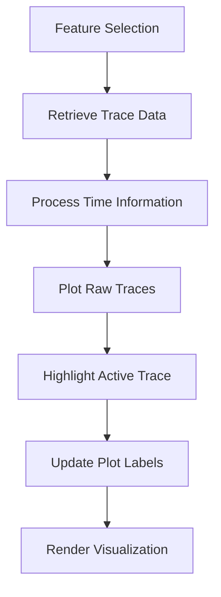
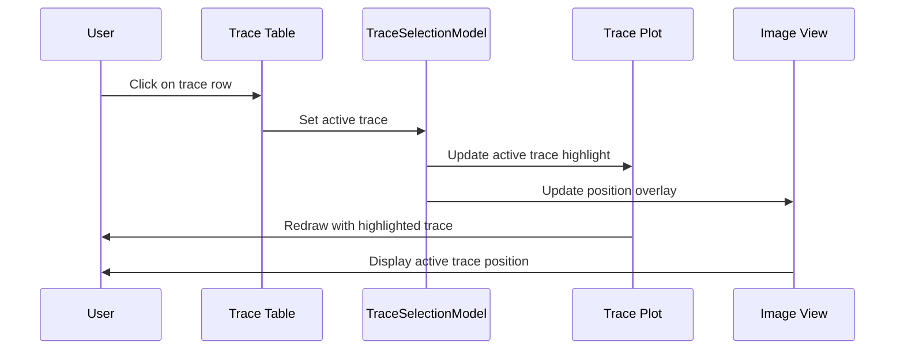
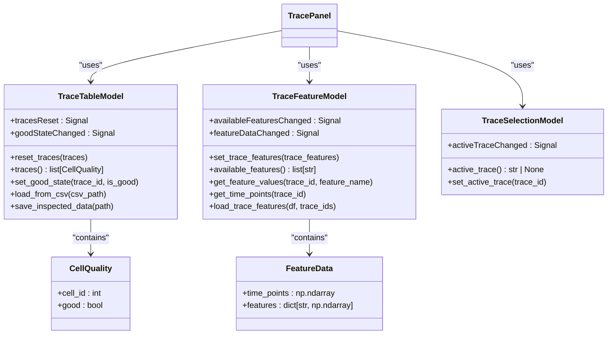
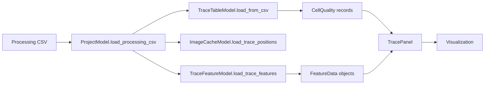
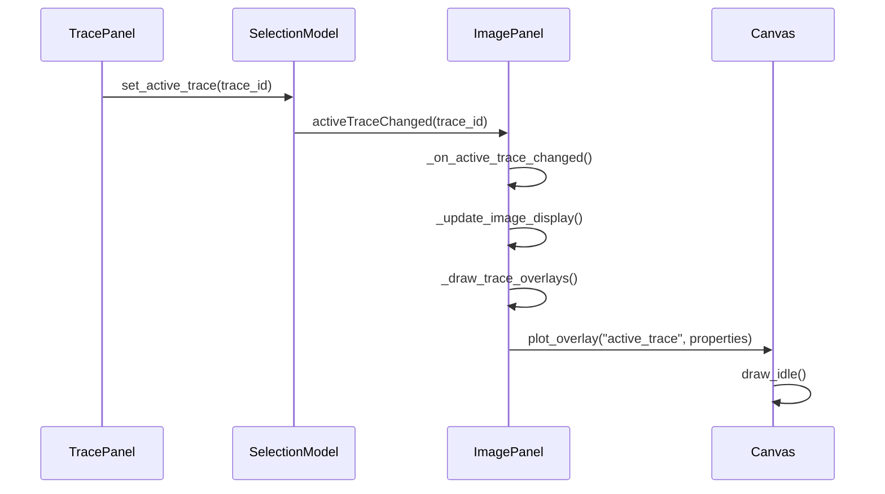

# Trace Analysis

<cite>
**Referenced Files in This Document**   
- [trace_panel.py](file://pyama-qt/src/pyama_qt/visualization/panels/trace_panel.py)
- [models.py](file://pyama-qt/src/pyama_qt/visualization/models.py)
- [image_panel.py](file://pyama-qt/src/pyama_qt/visualization/panels/image_panel.py)
- [mpl_canvas.py](file://pyama-qt/src/pyama_qt/components/mpl_canvas.py)
- [processing_csv.py](file://pyama-core/src/pyama_core/io/processing_csv.py)
</cite>

## Table of Contents
1. [Introduction](#introduction)
2. [Trace Panel Interface](#trace-panel-interface)
3. [Trace Visualization](#trace-visualization)
4. [Trace Selection and Interaction](#trace-selection-and-interaction)
5. [Model Integration](#model-integration)
6. [Data Flow and Processing](#data-flow-and-processing)
7. [Cross-Component Synchronization](#cross-component-synchronization)
8. [Data Management and Persistence](#data-management-and-persistence)
9. [User Interaction Patterns](#user-interaction-patterns)
10. [Error Handling and Edge Cases](#error-handling-and-edge-cases)

## Introduction
The Trace Analysis sub-feature provides a comprehensive interface for visualizing and interpreting intensity dynamics over time for segmented objects in microscopy data. This system enables researchers to analyze fluorescence or other quantitative measurements per cell across frames, facilitating the identification of biological patterns such as maturation processes, detection of outliers, and comparison of cellular responses under different experimental conditions. The implementation combines interactive visualization with robust data management, allowing users to explore temporal dynamics while maintaining the ability to annotate data quality and export results for further analysis.

## Trace Panel Interface

The TracePanel component serves as the primary interface for trace visualization and analysis. It presents a dual-panel layout with a plotting area for time series visualization and a selection interface for trace management. The panel includes a feature dropdown that allows users to select which quantitative measurement to visualize (e.g., intensity, area, perimeter), enabling comparative analysis across different cellular characteristics.

Pagination controls allow navigation through large datasets with "Previous" and "Next" buttons, accompanied by a page indicator showing the current position within the complete trace collection. The interface supports keyboard navigation with arrow keys for moving between traces and the spacebar for toggling trace quality status. Control buttons provide batch operations including "Check All" and "Uncheck All" for efficient quality annotation across multiple traces on the current page.

**Section sources**
- [trace_panel.py](file://pyama-qt/src/pyama_qt/visualization/panels/trace_panel.py#L31-L626)

## Trace Visualization

The trace visualization system plots fluorescence or other quantitative measurements for segmented cells across time frames using Matplotlib integration through the MplCanvas component. Each trace represents a single cell's temporal dynamics, with the x-axis showing either time (with appropriate units from project metadata) or frame indices when time data is unavailable. The y-axis displays the selected feature values, automatically labeled with the feature name.

Selected traces are plotted in gray with semi-transparent styling, while the active trace (currently selected for detailed examination) is highlighted in red with increased line thickness for clear visual distinction. The plot title indicates the current feature, number of displayed traces, and pagination status. When multiple traces are selected, they are overlaid on the same axes, enabling direct visual comparison of intensity dynamics across cells.

**Diagram sources**
- [trace_panel.py](file://pyama-qt/src/pyama_qt/visualization/panels/trace_panel.py#L478-L544)
- [mpl_canvas.py](file://pyama-qt/src/pyama_qt/components/mpl_canvas.py#L14-L199)

**Section sources**
- [trace_panel.py](file://pyama-qt/src/pyama_qt/visualization/panels/trace_panel.py#L478-L544)

## Trace Selection and Interaction

The trace selection system implements a checkable table interface where users can designate traces as "good" or "bad" based on data quality assessment. Each row in the table corresponds to a segmented cell, with a checkbox for quality annotation and a trace ID identifier. Selection state is synchronized between the table and the visualization, ensuring that only checked traces appear in the plot.

When a user clicks on a trace in the table, that trace becomes the active trace, triggering multiple system responses: it is highlighted in the trace plot, its position is overlaid on the image view, and it becomes the focus of any linked analysis tools. The selection model maintains the active trace state and emits signals to notify other components of selection changes, enabling coordinated behavior across the application.

Keyboard navigation enhances accessibility, allowing users to move between traces using arrow keys and toggle quality status with the spacebar. This design supports efficient review of large datasets without requiring mouse interaction for every operation.

**Diagram sources**
- [trace_panel.py](file://pyama-qt/src/pyama_qt/visualization/panels/trace_panel.py#L189-L206)
- [image_panel.py](file://pyama-qt/src/pyama_qt/visualization/panels/image_panel.py#L256-L258)

**Section sources**
- [trace_panel.py](file://pyama-qt/src/pyama_qt/visualization/panels/trace_panel.py#L175-L187)
- [trace_panel.py](file://pyama-qt/src/pyama_qt/visualization/panels/trace_panel.py#L189-L206)

## Model Integration

The trace analysis system relies on three primary models that encapsulate different aspects of trace data: TraceTableModel for quality annotations, TraceFeatureModel for time series data, and TraceSelectionModel for active trace state. These models follow the Qt model-view architecture, enabling clean separation between data and presentation.

The TraceTableModel manages cell quality information, storing trace IDs and their corresponding "good" status. It provides an interface for batch operations and emits signals when quality states change, allowing the visualization to update accordingly. The TraceFeatureModel encapsulates the actual time series data, organizing feature values by trace ID and feature name. It provides methods to retrieve specific feature values and time points for plotting. The TraceSelectionModel maintains the currently active trace, broadcasting selection changes to all interested components.

These models are bound to the TracePanel during initialization, establishing signal-slot connections that ensure automatic synchronization when data changes. This architecture enables multiple views to reflect the same underlying state without direct coupling between components.

**Diagram sources**
- [models.py](file://pyama-qt/src/pyama_qt/visualization/models.py#L403-L792)

**Section sources**
- [models.py](file://pyama-qt/src/pyama_qt/visualization/models.py#L403-L773)
- [models.py](file://pyama-qt/src/pyama_qt/visualization/models.py#L776-L792)

## Data Flow and Processing

The data flow for trace analysis begins with loading processing CSV files that contain extracted features for all segmented cells across all frames. The ProjectModel coordinates this process, loading the CSV data and distributing it to the appropriate models. The TraceTableModel extracts cell quality information, while the TraceFeatureModel organizes time series data by cell and feature.

Feature data is extracted from the processing dataframe using specialized functions that filter for specific cell IDs and organize temporal measurements. The extract_cell_feature_dataframe function retrieves all available features for a given cell, sorting by time to ensure proper temporal ordering. Similarly, extract_cell_position_dataframe extracts spatial coordinates that enable overlay of cell positions on the image view.

When visualizing traces, the system first retrieves the selected feature name from the dropdown, then obtains the corresponding values for each selected trace from the TraceFeatureModel. If time data is available and matches the length of feature values, it is used for the x-axis; otherwise, frame indices are used as a fallback. This flexible approach accommodates datasets with or without calibrated time information.

**Diagram sources**
- [models.py](file://pyama-qt/src/pyama_qt/visualization/models.py#L55-L227)
- [processing_csv.py](file://pyama-core/src/pyama_core/io/processing_csv.py#L63-L177)

**Section sources**
- [models.py](file://pyama-qt/src/pyama_qt/visualization/models.py#L55-L227)
- [processing_csv.py](file://pyama-core/src/pyama_core/io/processing_csv.py#L63-L177)

## Cross-Component Synchronization

The trace analysis system maintains tight synchronization between the trace visualization and image viewing components. When a trace is selected in the trace panel, the corresponding cell's position is overlaid on the current image frame, creating a direct link between temporal dynamics and spatial location. This bidirectional connection allows users to either select a cell in the image to view its intensity trace or select a trace to locate the corresponding cell in the image.

The ImagePanel listens for active trace changes and updates its display accordingly. When an active trace is set, the system checks if position data exists for that trace at the current frame. If so, a circular overlay is drawn at the cell's coordinates with distinctive styling (red edge, no fill) to ensure visibility against various image backgrounds. The overlay is automatically removed when the frame changes to a time point where the cell's position is not recorded or when no trace is active.

This synchronization enables powerful analysis patterns, such as identifying cells with unusual intensity dynamics and immediately visualizing their spatial context, or selecting cells in crowded regions to examine their individual temporal behavior separate from neighbors.

**Diagram sources**
- [image_panel.py](file://pyama-qt/src/pyama_qt/visualization/panels/image_panel.py#L180-L306)
- [trace_panel.py](file://pyama-qt/src/pyama_qt/visualization/panels/trace_panel.py#L189-L206)

**Section sources**
- [image_panel.py](file://pyama-qt/src/pyama_qt/visualization/panels/image_panel.py#L180-L217)
- [image_panel.py](file://pyama-qt/src/pyama_qt/visualization/panels/image_panel.py#L269-L306)

## Data Management and Persistence

The system implements a robust data management workflow that preserves user annotations while maintaining compatibility with the original processing data. When trace quality assessments are modified, the system does not alter the original CSV file directly. Instead, it creates a new file with an "_inspected" suffix that contains the updated quality labels, preserving the provenance of both the original automated processing and the subsequent manual curation.

The save operation is coordinated through the TraceTableModel's save_inspected_data method, which updates the processing dataframe with the current quality states and writes the result to the inspected CSV file. This approach ensures that analysis can be reproduced from the original data while also capturing expert annotations that may be critical for downstream interpretation.

The trace panel's save button is always enabled, encouraging users to save their progress frequently. The system automatically detects and prefers inspected CSV files when loading data, ensuring that the most recent annotations are used in subsequent analysis sessions. This creates a seamless workflow where users can close the application and resume their analysis with all previous selections preserved.

**Section sources**
- [trace_panel.py](file://pyama-qt/src/pyama_qt/visualization/panels/trace_panel.py#L294-L317)
- [models.py](file://pyama-qt/src/pyama_qt/visualization/models.py#L403-L651)

## User Interaction Patterns

The trace analysis interface supports several key interaction patterns that facilitate efficient data exploration and analysis. Users can quickly identify maturation patterns by selecting multiple traces and observing their temporal dynamics, looking for characteristic sigmoidal curves or other biological signatures in the intensity profiles.

For outlier detection, users can sort traces by various criteria (implicitly through the table pagination) and scan for traces that deviate significantly from the population, such as those with abnormally high or low intensities, irregular fluctuations, or premature signal decay. The ability to highlight a single trace in red against a background of gray traces makes these outliers immediately apparent.

Comparative analysis across experimental conditions is supported by loading different datasets and examining trace patterns side by side. Users can adjust plot ranges to focus on specific time intervals of interest or apply mental smoothing to noisy signals when assessing overall trends. The pagination system allows systematic review of large datasets, while keyboard shortcuts enable rapid navigation through traces.

The quality annotation system supports iterative refinement, where users first check all traces, then uncheck those with obvious artifacts, and finally fine-tune selections based on detailed examination. This workflow accommodates the reality of noisy biological data while providing a structured approach to data curation.

**Section sources**
- [trace_panel.py](file://pyama-qt/src/pyama_qt/visualization/panels/trace_panel.py#L559-L599)
- [trace_panel.py](file://pyama-qt/src/pyama_qt/visualization/panels/trace_panel.py#L175-L187)

## Error Handling and Edge Cases

The trace analysis system includes comprehensive error handling for common challenges in biological data analysis. Noisy signals are accommodated through the quality annotation system, allowing users to flag traces with excessive noise without removing them from the dataset entirely. Missing data points are handled gracefully by the plotting system, which displays available data points and interpolates only for visualization purposes without altering the underlying data.

Trace misalignment is mitigated through the use of time-calibrated axes when available, ensuring that biological events are compared at their actual temporal positions rather than by frame number. When time data is missing, the system defaults to frame indices but clearly labels the axis as "Frame" to avoid misinterpretation.

The system handles edge cases such as empty datasets, missing feature data, or corrupted CSV files by providing clear error messages and maintaining a stable interface state. Pagination controls are automatically disabled when insufficient traces exist, and feature dropdowns display "No features available" when appropriate. The initialization process includes safeguards to prevent null pointer exceptions when models are not yet bound.

Data validation occurs at multiple levels, from CSV file existence checks to verification of required columns in the processing dataframe. When errors occur during file operations, detailed messages are logged and presented to the user, facilitating troubleshooting while preventing application crashes.

**Section sources**
- [models.py](file://pyama-qt/src/pyama_qt/visualization/models.py#L403-L651)
- [processing_csv.py](file://pyama-core/src/pyama_core/io/processing_csv.py#L19-L40)