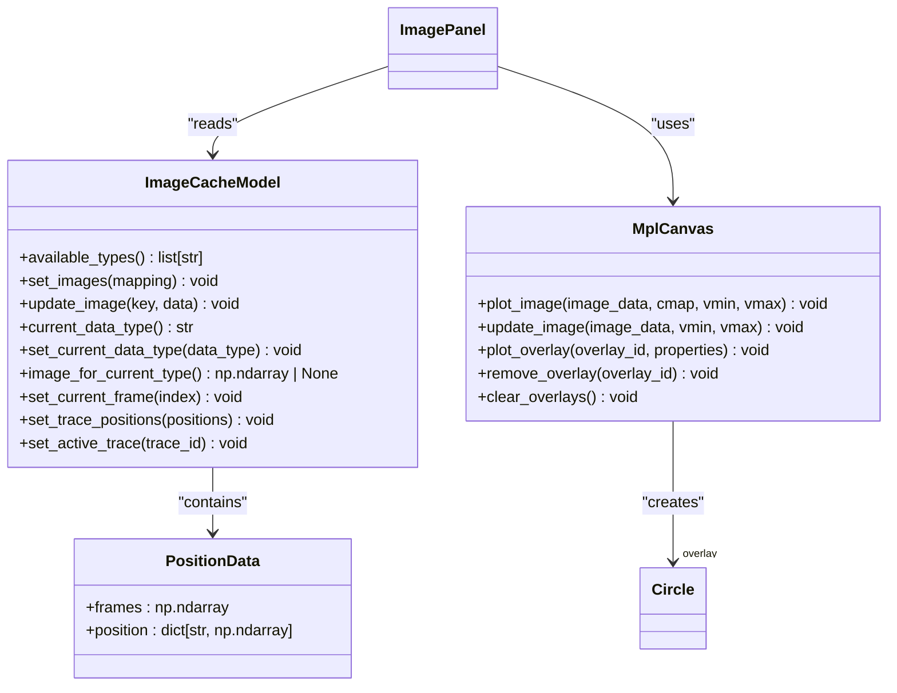
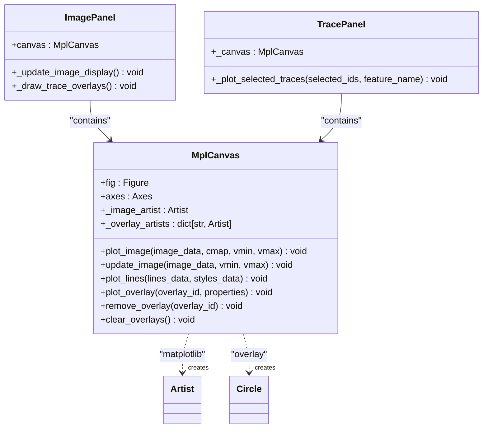

# Visualization Module

<cite>
**Referenced Files in This Document**   
- [image_panel.py](file://pyama-qt/src/pyama_qt/visualization/panels/image_panel.py)
- [trace_panel.py](file://pyama-qt/src/pyama_qt/visualization/panels/trace_panel.py)
- [project_panel.py](file://pyama-qt/src/pyama_qt/visualization/panels/project_panel.py)
- [mpl_canvas.py](file://pyama-qt/src/pyama_qt/components/mpl_canvas.py)
- [models.py](file://pyama-qt/src/pyama_qt/visualization/models.py)
</cite>

## Table of Contents
1. [Project Loading and Directory Navigation](#project-loading-and-directory-navigation)
2. [Multi-Channel Image Viewer with Time-Series Playback](#multi-channel-image-viewer-with-time-series-playback)
3. [Trace Analysis Tools for Intensity Dynamics](#trace-analysis-tools-for-intensity-dynamics)
4. [Synchronized Selection Across Views](#synchronized-selection-across-views)
5. [Visualization of Segmentation Masks and Tracking Trajectories](#visualization-of-segmentation-masks-and-tracking-trajectories)
6. [Interactive Controls: Zoom, Pan, and Contrast Adjustment](#interactive-controls-zoom-pan-and-contrast-adjustment)
7. [Performance Optimization and Memory Management](#performance-optimization-and-memory-management)
8. [Comparative Analysis Between FOVs and Conditions](#comparative-analysis-between-fovs-and-conditions)
9. [Integration with Matplotlib and Qt Graphics](#integration-with-matplotlib-and-qt-graphics)

## Project Loading and Directory Navigation

The Visualization Module provides a structured workflow for loading and navigating microscopy data through the `ProjectPanel` component. Users initiate data exploration by selecting a directory containing Field of View (FOV) subdirectories via the "Load Folder" button. Upon selection, the system analyzes the directory structure and populates project metadata in the interface, including the number of FOVs, available channels, time units, and data types.

The `ProjectModel` manages project-level state and emits signals when data changes, enabling responsive updates across the application. Users can navigate between FOVs using a spinbox control that dynamically adjusts its range based on the available FOV indices in the loaded project. Channel selection is facilitated through a multi-selection list view that displays all available channels from the dataset, allowing users to choose which channels to load for visualization.

When the user clicks "Start Visualization," the system emits a signal with the selected FOV index and channel list, triggering the loading of corresponding image data into the visualization components. The panel also provides real-time status feedback through a progress bar and status message system, indicating loading progress and potential errors.

**Section sources**
- [project_panel.py](file://pyama-qt/src/pyama_qt/visualization/panels/project_panel.py#L1-L337)
- [models.py](file://pyama-qt/src/pyama_qt/visualization/models.py#L55-L227)

## Multi-Channel Image Viewer with Time-Series Playback

The `ImagePanel` provides a comprehensive viewer for multi-channel microscopy data with integrated time-series playback controls. The interface includes navigation buttons for frame-by-frame progression ("\<" and "\>") as well as rapid navigation ("<<" and ">>") to move backward and forward by 10 frames. A frame label displays the current position in the time series (e.g., "Frame 45/200").

Users can switch between different data types through a dropdown menu that automatically populates with available image types such as raw fluorescence, phase contrast, segmentation masks, or processed data. The viewer supports both single-frame images and time-series data, automatically detecting the dimensionality of the input data.

The image display is implemented using the `MplCanvas` component, which renders images with appropriate colormaps and scaling. Fluorescence and phase contrast data use a grayscale colormap with intensity scaling based on the actual data range, while segmentation data uses a viridis colormap with discrete scaling to distinguish different segmented objects.

**Section sources**
- [image_panel.py](file://pyama-qt/src/pyama_qt/visualization/panels/image_panel.py#L1-L308)
- [models.py](file://pyama-qt/src/pyama_qt/visualization/models.py#L229-L397)

## Trace Analysis Tools for Intensity Dynamics

The `TracePanel` enables detailed analysis of intensity dynamics over time through an integrated plotting interface and trace selection system. The panel displays time-series traces for various cellular features, with the x-axis representing time (or frame number) and the y-axis representing the selected feature's values.

Users can select which feature to visualize from a dropdown menu that automatically populates with available features from the processing data. The trace table allows users to select specific traces for plotting by checking the "Good" column. Up to five traces are automatically checked by default to provide an initial view of the data.

The plotting system highlights the active trace in red with increased line thickness, while other selected traces appear in gray with transparency. Pagination controls allow navigation through large numbers of traces, with 10 traces displayed per page. Users can navigate pages using "Previous" and "Next" buttons or keyboard navigation (arrow keys).

Trace selection can be modified through the table interface, where users can check or uncheck individual traces, or use "Check All" and "Uncheck All" buttons to modify selections on the current page. The spacebar can be used to toggle the selection status of the currently focused trace.

**Section sources**
- [trace_panel.py](file://pyama-qt/src/pyama_qt/visualization/panels/trace_panel.py#L1-L629)
- [models.py](file://pyama-qt/src/pyama_qt/visualization/models.py#L654-L773)

## Synchronized Selection Across Views

The Visualization Module implements synchronized selection across different views through a coordinated model-view architecture. The `TraceSelectionModel` serves as the central state manager for the active trace, emitting signals when the selection changes. When a user selects a trace in the `TracePanel`, the `TraceSelectionModel` updates and notifies all connected components.

The `ImagePanel` listens to active trace changes and updates its display to show the position of the selected trace overlaid on the current image frame. If the trace exists in the current frame, a red circle with a transparent fill is drawn at the trace's x,y coordinates. This provides immediate visual feedback of the selected cell's location within the field of view.

Similarly, when a user interacts with the image viewer and potentially selects a cell (through future extensions), the `ImagePanel` would update the `TraceSelectionModel`, which in turn would cause the `TracePanel` to highlight the corresponding trace in the table and bring it to the forefront in the plot. This bidirectional synchronization ensures that all views remain consistent with the current selection state.

The `ProjectPanel` also participates in this synchronization by updating its FOV selection based on the active trace's location, ensuring that users are viewing the correct field of view when navigating between different data representations.

**Section sources**
- [image_panel.py](file://pyama-qt/src/pyama_qt/visualization/panels/image_panel.py#L1-L308)
- [trace_panel.py](file://pyama-qt/src/pyama_qt/visualization/panels/trace_panel.py#L1-L629)
- [models.py](file://pyama-qt/src/pyama_qt/visualization/models.py#L776-L792)

## Visualization of Segmentation Masks and Tracking Trajectories

The module provides overlay visualization of segmentation masks and tracking trajectories on raw microscopy images. Segmentation masks are displayed using the viridis colormap with discrete intensity scaling, allowing users to distinguish between different segmented objects. The intensity range for segmentation visualization is calculated from the entire mask data to ensure consistent appearance across frames.

Tracking trajectories are visualized as circular overlays positioned at the centroid coordinates of each cell. The active trace is highlighted with a red circular outline, making it easily distinguishable from other cells in the field of view. The overlay system uses matplotlib patches to draw these annotations on top of the base image, with a high z-order value to ensure they appear above the image data.

The `ImageCacheModel` stores position data for all traces in the `PositionData` structure, which contains arrays of frame indices and corresponding x,y coordinates. When the current frame changes, the viewer checks if the active trace exists in that frame and updates the overlay position accordingly. If the trace is not present in the current frame (e.g., the cell has divided or moved out of view), the overlay is removed.

This visualization approach enables users to verify the accuracy of segmentation and tracking algorithms by comparing the automated results with the underlying microscopy data, facilitating quality control and error detection in the analysis pipeline.

**Diagram sources**
- [image_panel.py](file://pyama-qt/src/pyama_qt/visualization/panels/image_panel.py#L1-L308)
- [models.py](file://pyama-qt/src/pyama_qt/visualization/models.py#L229-L397)
- [mpl_canvas.py](file://pyama-qt/src/pyama_qt/components/mpl_canvas.py#L1-L201)

**Section sources**
- [image_panel.py](file://pyama-qt/src/pyama_qt/visualization/panels/image_panel.py#L1-L308)
- [models.py](file://pyama-qt/src/pyama_qt/visualization/models.py#L229-L397)

## Interactive Controls: Zoom, Pan, and Contrast Adjustment

While explicit zoom, pan, and contrast controls are not directly implemented in the current panel code, the underlying `MplCanvas` component provides the foundation for these interactive features. The canvas is built on matplotlib's Qt5Agg backend, which natively supports zoom and pan interactions through toolbar controls or mouse gestures (scroll to zoom, click and drag to pan).

The `plot_image` method in `MplCanvas` includes parameters for contrast adjustment through the `vmin` and `vmax` arguments, which set the intensity scaling range for image display. For fluorescence and phase contrast data, these values are automatically calculated from the entire image data range to ensure consistent appearance across frames, preventing brightness fluctuations during time-series playback.

The image display is configured with `origin="upper"` and `extent` parameters that properly map pixel coordinates to the display space, maintaining the correct spatial orientation of the microscopy data. The aspect ratio is set to "equal" to preserve the original proportions of the image.

Future extensions could add manual contrast adjustment sliders that modify the `vmin` and `vmax` parameters, or implement region-of-interest selection for focused analysis. The current implementation focuses on providing a stable viewing experience with automatic scaling appropriate for the data type being displayed.

**Section sources**
- [image_panel.py](file://pyama-qt/src/pyama_qt/visualization/panels/image_panel.py#L1-L308)
- [mpl_canvas.py](file://pyama-qt/src/pyama_qt/components/mpl_canvas.py#L1-L201)

## Performance Optimization and Memory Management

The Visualization Module implements several strategies for performance optimization and memory management when handling large microscopy datasets. The `ImageCacheModel` serves as a central image data repository that stores preprocessed image arrays in memory, eliminating the need to reload data from disk during navigation.

For time-series data, the entire sequence is loaded into memory as a 3D or 4D numpy array, enabling rapid frame-to-frame navigation without I/O overhead. The model calculates intensity scaling parameters (min/max values) once from the entire dataset to ensure consistent appearance across frames, avoiding per-frame recalculations during playback.

Memory usage is optimized by storing only one copy of each image type, with the `ImagePanel` accessing the current frame through array indexing rather than maintaining separate copies. The trace data is stored efficiently in structured formats, with position and feature data separated into dedicated models (`TraceTableModel` and `TraceFeatureModel`) to minimize memory footprint.

The pagination system in the `TracePanel` limits the number of traces displayed at once to 10 per page, reducing the computational load of rendering large numbers of time-series plots. Only traces on the current page that are marked as "good" are plotted, further optimizing performance.

The application uses Qt's model-view architecture to separate data storage from presentation, enabling efficient updates through signals and slots rather than full UI refreshes. This approach minimizes unnecessary computations and redraws when data changes.

**Section sources**
- [image_panel.py](file://pyama-qt/src/pyama_qt/visualization/panels/image_panel.py#L1-L308)
- [trace_panel.py](file://pyama-qt/src/pyama_qt/visualization/panels/trace_panel.py#L1-L629)
- [models.py](file://pyama-qt/src/pyama_qt/visualization/models.py#L229-L397)

## Comparative Analysis Between FOVs and Conditions

The Visualization Module supports comparative analysis between different FOVs and experimental conditions through its structured data navigation and visualization capabilities. Users can load multiple projects or navigate between different FOVs within a project to compare cellular behavior across spatial locations or experimental conditions.

The trace analysis system enables comparison of intensity dynamics across different cells within the same FOV or between cells in different conditions. By selecting multiple traces from different conditions, users can overlay their time-series data in the `TracePanel` to visually compare features such as fluorescence intensity, growth rates, or response dynamics.

The channel selection system allows users to compare different imaging modalities (e.g., phase contrast vs. fluorescence) for the same FOV, facilitating multimodal analysis of cellular behavior. The ability to switch between different data types (raw, segmented, processed) enables comparison of analysis results with the original microscopy data.

For presentation preparation, users can generate consistent visualizations across different datasets by maintaining the same visualization parameters (colormaps, scaling, overlay styles), ensuring that comparisons are meaningful and visually coherent. The synchronized selection system ensures that when comparing specific cells across conditions, the corresponding data is consistently highlighted across all views.

**Section sources**
- [project_panel.py](file://pyama-qt/src/pyama_qt/visualization/panels/project_panel.py#L1-L337)
- [trace_panel.py](file://pyama-qt/src/pyama_qt/visualization/panels/trace_panel.py#L1-L629)

## Integration with Matplotlib and Qt Graphics

The Visualization Module integrates matplotlib with Qt graphics through the `MplCanvas` component, which serves as a bridge between the matplotlib plotting library and the Qt application framework. This custom canvas class inherits from `FigureCanvasQTAgg` and provides a high-level API for plotting images, lines, scatter plots, histograms, and overlays.

The `MplCanvas` exposes methods for different visualization types: `plot_image` for displaying microscopy data, `plot_lines` for time-series traces, `plot_histogram` for distribution analysis, and overlay methods for annotating images with geometric shapes. These methods abstract the complexity of matplotlib's object-oriented interface, providing a simplified API for the visualization panels.

The canvas handles coordinate systems and display parameters automatically, setting appropriate ticks, labels, and aspect ratios for different types of data. It manages matplotlib artists directly, storing references to image and overlay artists for efficient updates without full redraws.

Event handling is integrated through Qt's signal-slot mechanism, with the canvas automatically updating when data changes. The `draw_idle()` method is used to schedule redraws efficiently, preventing excessive UI updates during rapid interactions like frame navigation.

This integration enables the creation of publication-quality visualizations that can be easily exported or included in presentations, while maintaining interactive performance for data exploration.

**Diagram sources**
- [mpl_canvas.py](file://pyama-qt/src/pyama_qt/components/mpl_canvas.py#L1-L201)
- [image_panel.py](file://pyama-qt/src/pyama_qt/visualization/panels/image_panel.py#L1-L308)
- [trace_panel.py](file://pyama-qt/src/pyama_qt/visualization/panels/trace_panel.py#L1-L629)

**Section sources**
- [mpl_canvas.py](file://pyama-qt/src/pyama_qt/components/mpl_canvas.py#L1-L201)
- [image_panel.py](file://pyama-qt/src/pyama_qt/visualization/panels/image_panel.py#L1-L308)
- [trace_panel.py](file://pyama-qt/src/pyama_qt/visualization/panels/trace_panel.py#L1-L629)